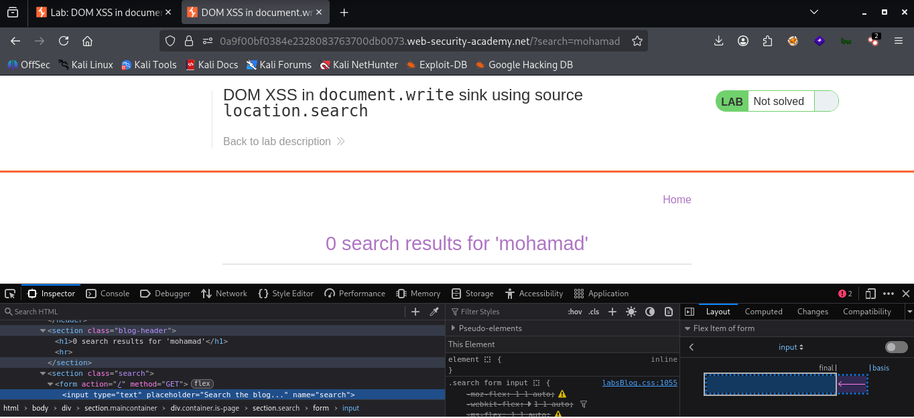
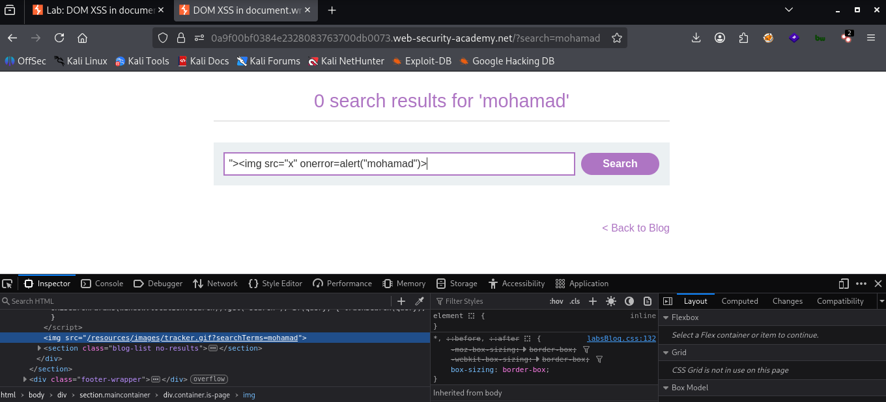

# LAB 04 -  DOM XSS in innerHTML sink using source location.search

## Lab Information

- **Category:** Cross-Site Scripting (XSS)
- **Type:** DOM-based 
- **Difficulty:** Apprentice
- **Status:** ✅ Solved
- **Date:** 2026-8-7

---


---

# Table of Contents

- Executive Summary
- Lab Information
- Objective
- Vulnerability Overview
- Attack Prerequisites
- Environment & Scope
- Methodology
- Discovery Process
- Technical Analysis
- Payload Analysis
- Exploitation Flow
- Evidence
- Impact
- Root Cause
- Risk Assessment
- Remediation
- Lessons Learned
- References
- Screenshots

---

# Executive Summary

In this lab, a DOM-based XSS vulnerability was identified where attacker-controlled input—derived from `location.search`—was passed to an `.innerHTML` sink. By injecting an `` element with an `onerror` event handler, the execution of JavaScript code via `alert(1)` was demonstrated.

---

# Objective

The objective of this lab is to exploit a DOM-based XSS vulnerability caused by the unsafe flow of attacker-controlled data from `location.search` (source) to `.innerHTML` (sink).

---

# Vulnerability Overview

A DOM-based XSS (Document Object Model-based Cross-Site Scripting) vulnerability is a type of security flaw that occurs entirely within the user's browser on the client side. It happens when JavaScript code takes data from an attacker-controllable source and passes it—unsanitized—to a dangerous function that executes code (a "sink").
The vulnerability arises when three key elements are present in the page's code: the source, the data flow and processing, and the dangerous destination or sink In this lab, the attacker-controlled input originates from `location.search` and is passed to `.innerHTML`, which writes the data into the HTML document without proper encoding.

---

# Attack Prerequisites

- A client-side JavaScript source that can be controlled by the attacker, such as `location.search`.
- An unsafe sink such as `document.write()` that inserts attacker-controlled data into the HTML document.
- No effective output encoding or sanitization between the source and sink.

---

# Environment & Scope

| Item              | Value |
|-------------------|-------|
| Target            | PortSwigger Web Security Academy lab |
| HTTP Method       | GET |
| Source            | `location.search` |
| Sink              | `document.write()` |
| Injection Context | HTML Attribute |
| Client            | Web Browser |

---

# Methodology

1. Open the vulnerable lab and identify the search functionality.
2. Submit a normal search term and observe how it is reflected in the page.
3. Inspect the client-side JavaScript using browser Developer Tools.
4. Identify `location.search` as the attacker-controlled source.
5. Trace the data flow to the `document.write()` sink.
6. Identify the HTML attribute context created by `document.write()`.
7. Break out of the existing attribute context.
8. Inject an `` element with an `onerror` event handler.
9. Verify JavaScript execution using `alert()`.

---

# Discovery Process

### Step 1 — Normal Input

```text
mohamad
```

The application reflected the search term into an HTML attribute.

### Step 2 — Context Testing

```text
mohamad">
```

The quotation mark allowed the existing attribute context to be terminated.

### Step 3 — HTML Injection

```html
mohamad">
```

The injected  element was interpreted as HTML, and the onerror handler executed when the image failed to load.

---

# Technical Analysis

The application reads the query string through `location.search` and passes the resulting value to `document.write()`.

The generated HTML initially contains:

```html

```

After injecting the payload, the browser receives HTML equivalent to:

```html
search:


```
The first double quote closes the original src attribute. The injected  element then creates an onerror event handler that executes JavaScript when the image fails to load.

---

# Source and Sink Analysis

## Source

```javascript
location.search
```
The source is attacker-controlled because the attacker can modify the query string in the URL.

## Data Flow

The value from location.search is concatenated into an HTML string.

## Sink

```javascript
document.write()
```
document.write() writes the constructed string into the HTML document, allowing the injected markup to be interpreted by the browser.

---

# Payload Analysis

## Payload Used

```html

">

```

## Why This Payload Works

The payload first closes the existing `src` attribute using `"`, then closes the original HTML element with `>`. It injects a new `` element with an invalid `src` value. When the browser fails to load the image, the `onerror` event handler is triggered and executes the JavaScript payload.

---

# Exploitation Flow

```text
Attacker
      │
      ▼
URL Query Parameter
      │
      ▼
location.search
      │
      ▼
document.write()
      │
      ▼
DOM / HTML
      │
      ▼
Browser Parses Injected HTML
      │
      ▼
onerror Event
      │
      ▼
JavaScript Execution
```

---

# Evidence

## HTML Before Injection

```html

```

---

## HTML After Injection

```http

 
```

---

# Impact

- Access to sensitive information available to JavaScript.
- Session compromise in scenarios where session tokens are accessible to JavaScript.
- Performing unauthorized actions in the victim's security context.
- Phishing and page manipulation.
- Redirecting users to malicious pages.
  
---

# Root Cause

A DOM-based XSS vulnerability occurs when client side JavaScript code takes data from attacker-controlled input (known as the "Source") and passes it unsafely to a function or property that executes code in the browser (known as the "Sink"), resulting in the execution of malicious code.

---

# Risk Assessment

| Item | Value |
|------|-------|
| Severity | Medium |
| CVSS Score | Not calculated |
| CWE | CWE-79 |
| OWASP Category | Cross-Site Scripting (XSS) |
| Exploitability | High / Easy |
| Business Impact | Theft of customer accounts and sensitive data , Financial fraud and theft of funds , Reputational damage and loss of trust , Legal Fines and Penalties , Business disruption and incident response costs|

---

# Remediation

- Avoid dangerous DOM sinks such as `document.write()` when processing untrusted input.
- Use safe DOM APIs such as `textContent` when inserting text.
- Apply context-aware output encoding.
- Validate and sanitize untrusted input where appropriate.
- Implement a restrictive Content Security Policy (CSP) as an additional defense layer.
  
---

# Lessons Learned

- DOM XSS can occur entirely on the client side without the server reflecting the payload.
- `location.search` can act as an attacker-controlled source.
- `document.write()` can become a dangerous sink when used with untrusted data.
- The injection context determines how the payload must be constructed.
- Breaking out of an HTML attribute can allow injection of a new HTML element.
- Understanding Source → Data Flow → Sink is essential when analyzing DOM-based XSS.

---

# References

- OWASP
- PortSwigger Web Security Academy
- MITRE CWE
- CVSS Specification

---

# Screenshots

## Initial Page



...

## Payload Injection



...

## Successful Alert


---

# Conclusion

This lab demonstrated how a DOM-based XSS vulnerability can arise when attacker-controlled data flows from `location.search` to the unsafe `document.write()` sink.

The key lesson was that successful XSS exploitation depends on identifying the injection context and tracing the data flow from source to sink. In this case, breaking out of the HTML attribute context allowed the injection of a new element and execution of JavaScript through an `onerror` event handler.
