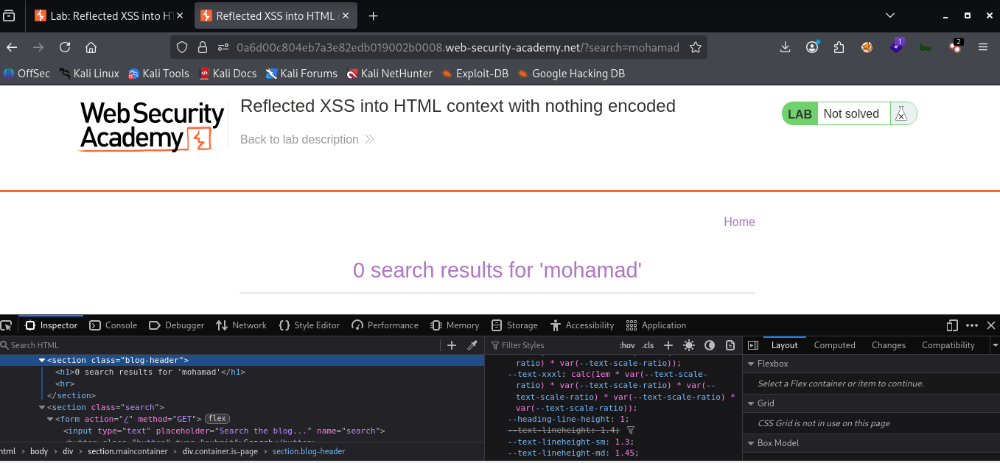
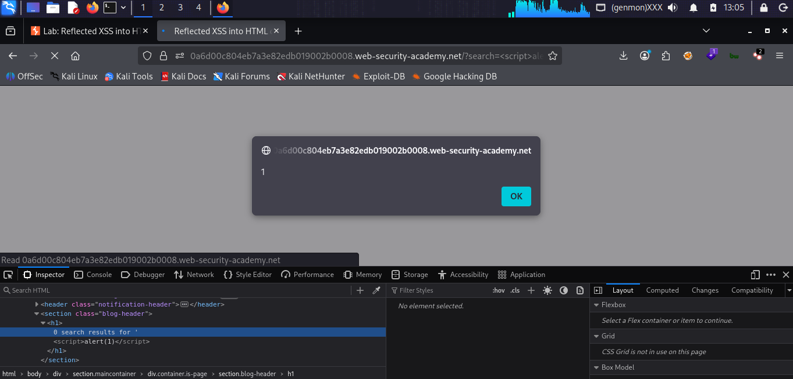

# LAB 01 - Reflected XSS into HTML context with nothing encoded

## Lab Information

- **Category:** Cross-Site Scripting (XSS)
- **Type:** Reflected 
- **Difficulty:** Apprentice
- **Status:** ✅ Solved
- **Date:** 2026-8-3

---


---

# Objective

The objective of this lab is to exploit a reflected Cross-Site Scripting (XSS) vulnerability by injecting JavaScript into an HTML response that is returned without output encoding.

---

# Vulnerability Overview

A reflected Cross-Site Scripting (XSS) vulnerability occurs when user-controlled input is included in the HTML response without proper output encoding, allowing the browser to interpret the input as executable code.

---

# Attack Prerequisites

- User input is reflected in the HTTP response.
- Input is not HTML encoded.
- JavaScript execution is allowed.

---

# Browser Behavior

1. Browser receives HTML.
2. Browser parses HTML.
3. Browser encounters a `<script>` tag.
4. Browser executes the JavaScript.

---

# Methodology

1. Browse to the vulnerable page.
2. Identify the search parameter.
3. Test HTML injection.
4. Confirm that HTML is not encoded.
5. Inject JavaScript.
6. Observe successful execution.

---

# Payload Used

```html
<script>alert(1)</script>
```

The browser was executing

```html
<section class="blog-header">
0 results for '
<h1>
<script>alert(1)</script>
</h1>
</section>
```

---

# Why It Worked

The application reflected user input directly into the HTML response without encoding special characters. When the browser parsed the HTML document, it interpreted the injected `<script>` element as executable JavaScript and executed it.

---

# Exploitation Flow

```
Attacker
      │
      ▼
Inject Payload
      │
      ▼
Web Server
      │
Returns HTML
      │
      ▼
Victim Browser
      │
Parses HTML
      │
      ▼
Executes JavaScript
```

---

# Impact

Executing malicious JavaScript code can lead to
- Session hijacking
- Cookie theft (if cookies are not protected with HttpOnly)
- Credential theft
- Phishing
- Defacement
- Performing actions as the victim

---

# Root Cause

The application reflects user-controlled input into the HTML response without proper output encoding or sanitization.

---

# Remediation

- Output Encoding : is a security technique that converts unsafe data into a safe, plain format before displaying it to the user. Its goal is to prevent the browser from executing malicious code and to protect websites against injection attacks, such as Cross-Site Scripting (XSS).
- Input Validation : The process of verifying and confirming that input data meets the required criteria, is secure, and is in the correct format before being processed by the system.
- Content Security Policy (CSP) : A web security standard that enables website owners to control the resources a browser is permitted to load and execute.
- HttpOnly Cookies : A special type of cookie that cannot be accessed by JavaScript code.
- Secure Frameworks : Use frameworks that automatically escape HTML output.
---

# Lessons Learned

- Browsers execute JavaScript inside `<script>` tags.
- HTML encoding prevents browser interpretation.
- XSS targets the client, not the server.
- Understanding HTML context is essential.

---

# Attack Flow Summary

```
Find Reflection
        │
        ▼
Check Encoding
        │
        ▼
Inject HTML
        │
        ▼
Inject JavaScript
        │
        ▼
Browser Executes Code
```

---

# Technical Analysis

Show the response before injection.

```html
You searched for:

TEST
```

Show the response after injection.

```html
You searched for:

<script>alert(1)</script>
```

The payload was reflected into the HTML response exactly as supplied. Since no output encoding was applied, the browser interpreted the <script> element and executed the JavaScript code.

---

# Security Notes

The payload executes because the browser trusts the HTML document returned by the server.
Search results must be safely encoded before being rendered.

---

# Key Takeaways

- Reflected XSS executes immediately.
- HTML Context determines payload behavior.
- Browsers execute JavaScript—not web servers.
- Output encoding is the primary defense.

---

## Context Analysis

Injection Context: HTML Body

HTML Encoding: None

JavaScript Execution: Allowed

Payload Type: Script Injection

Reflection Type: Immediate (Reflected)

---

# Screenshots

## Initial Page



...

## Payload Injection



...

## Successful Alert


...
