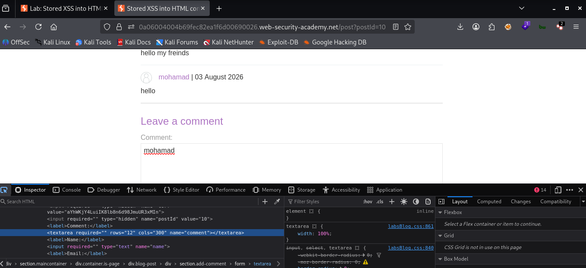
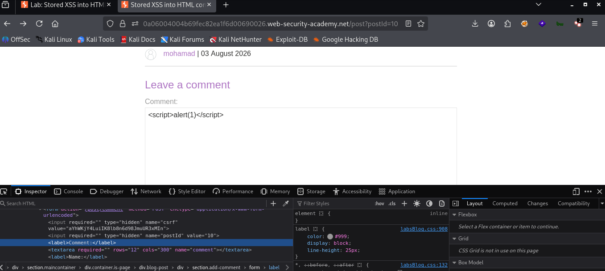
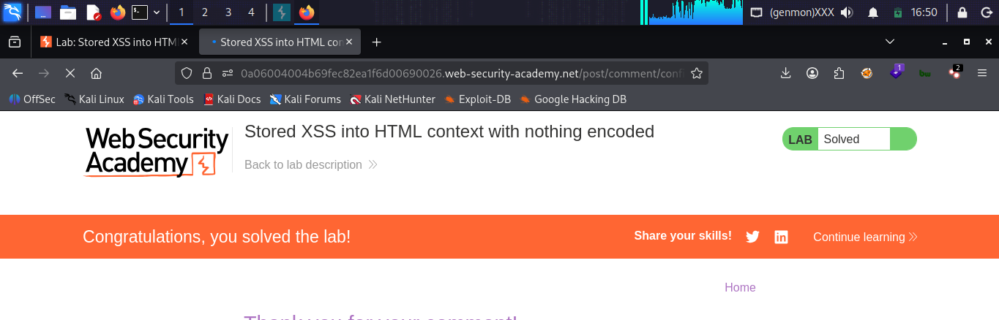

# LAB 02 - Stored XSS into HTML context with nothing encoded

## Lab Information

- **Category:** Cross-Site Scripting (XSS)
- **Type:** Stored 
- **Difficulty:** Apprentice
- **Status:** ✅ Solved
- **Date:** 2026-8-4

---


---

# Objective

The objective of this lab is to exploit a stored Cross-Site Scripting (XSS) vulnerability by injecting JavaScript into an HTML response that is returned without output encoding.

---

# Vulnerability Overview

A stored Cross-Site Scripting (XSS) vulnerability occurs When a website accepts unsafe user input, stores it permanently on the server (such as in a database), and later displays it to other users without sanitization or encoding.

---

# XSS Type Comparison

| Reflected XSS | Stored XSS |
|---------------|------------|
| Payload is reflected immediately. | Payload is stored on the server. |
| Requires victim to open a crafted URL. | Executes whenever users view the stored content. |
| Usually affects one request. | Can affect many users. |

---

# Attack Prerequisites

- The application stores user input on the server.
- Stored data is displayed to users without output encoding.
- JavaScript execution is allowed in the browser.

---

# Browser Behavior

1. Browser receives HTML.
2. Browser parses HTML.
3. Browser encounters a `<script>` tag.
4. Browser executes the JavaScript.

---

# Methodology

1. Browse to the vulnerable blog post.
2. Submit a comment.
3. Test HTML injection.
4. Confirm that the input is stored.
5. Inject a JavaScript payload.
6. Reload the page.
7. Observe JavaScript execution.

---

# Payload Used

```html
<script>alert(1)</script>
```

The browser was executing

```html
<label>
comment
<textarea required="" name="comment">
<script>alert(1)</script>
</textarea>
</label>
```

---

# Why It Worked

The application stored user input on the server and later included it in the HTML response without output encoding. When another user viewed the page, the browser interpreted the injected <script> element and executed the JavaScript.

---


# Exploitation Flow
```
Attacker
      │
      ▼
Submit Malicious Comment
      │
      ▼
Web Server
      │
Stores Payload
      │
      ▼
Victim Requests Page
      │
      ▼
Server Returns Stored Payload
      │
      ▼
Victim Browser
      │
      ▼
Executes JavaScript
```
---

# Impact

Executing malicious JavaScript code can lead to
- Session hijacking
- Cookie theft (if cookies are not protected with HttpOnly)
- Credential theft
- Phishing
- Defacement
- Performing actions as the victim

---

# Root Cause

The application stores user-controlled input and later renders it without proper output encoding or sanitization.

---

# Remediation

- Output Encoding : is a security technique that converts unsafe data into a safe, plain format before displaying it to the user. Its goal is to prevent the browser from executing malicious code and to protect websites against injection attacks, such as Cross-Site Scripting (XSS).
- Input Validation : The process of verifying and confirming that input data meets the required criteria, is secure, and is in the correct format before being processed by the system.
- Content Security Policy (CSP) : A web security standard that enables website owners to control the resources a browser is permitted to load and execute.
- HttpOnly Cookies : A special type of cookie that cannot be accessed by JavaScript code.
- Use templating engines that automatically perform context-aware output encoding.
---

# Lessons Learned

- Browsers execute JavaScript inside `<script>` tags.
- HTML encoding prevents browser interpretation.
- XSS targets the client, not the server.
- Understanding HTML context is essential.

---

# Attack Flow Summary

```
Submit Comment
      │
      ▼
Store Payload
      │
      ▼
Retrieve Stored Content
      │
      ▼
Browser Parses HTML
      │
      ▼
Execute JavaScript
```

---

# Technical Analysis

Show the response before injection.

```html
Comment:

Hello 

```

Show the response after injection.

```html
Comment:

<script>alert(1)</script>
```

The comment was stored in the database and then displayed.

---

# Security Notes

The payload executes because the browser trusts the HTML document returned by the server.
Stored user-generated content must always be safely encoded before being rendered in HTML.

---

# Key Takeaways

- A Stored Cross-Site Scripting (Stored XSS) attack is carried out by injecting malicious code (such as JavaScript) into a website input field, where it is permanently stored in the database.
- HTML Context determines payload behavior.
- Browsers execute JavaScript—not web servers.
- Output encoding is the primary defense.
- Stored XSS is generally more dangerous than Reflected XSS because the malicious payload is executed automatically whenever another user views the affected page.

---

## Context Analysis

- **Injection Context:** HTML Body

- **HTML Encoding:** None

- **JavaScript Execution:** Allowed

- **Payload Type:** Script Injection

- **Reflection Type:** Stored

---

# Screenshots

## Initial Page



...

## Payload Injection



...

## Successful Alert



...
