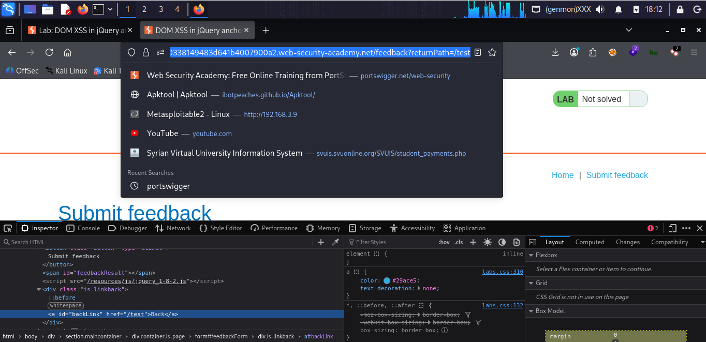

# LAB 05 -  DOM XSS in jQuery anchor href attribute sink using location.search

## Lab Information

- **Category:** Cross-Site Scripting (XSS)
- **Type:** DOM-based 
- **Difficulty:** Apprentice
- **Status:** ✅ Solved
- **Date:** 2026-8-11

---


---

# Table of Contents

- Executive Summary
- Lab Information
- Objective
- Vulnerability Overview
- Attack Prerequisites
- Environment & Scope
- Methodology
- Discovery Process
- Technical Analysis
- Payload Analysis
- Exploitation Flow
- Evidence
- Impact
- Root Cause
- Risk Assessment
- Remediation
- Lessons Learned
- References
- Screenshots

---

# Executive Summary

In this lab, a DOM-based XSS vulnerability was identified, where attacker controlled input derived from `location.search` was passed to a `.attr('href', ...)` sink. This was achieved by injecting JavaScript code directly into the link, as the `href` attribute accepts various URI schemes.

---

# Objective

The objective of this lab is to exploit a DOM-based XSS vulnerability caused by the unsafe flow of attacker-controlled data from `location.search` (source) to `.attr('href', ...)` (sink).

---

# Vulnerability Overview

A DOM-based XSS (Document Object Model-based Cross-Site Scripting) vulnerability is a type of security flaw that occurs entirely within the user's browser on the client side. It happens when JavaScript code takes data from an attacker-controllable source and passes it—unsanitized—to a dangerous function that executes code (a "sink").
The vulnerability arises when three key elements are present in the page's code: the source, the data flow and processing, and the dangerous destination or sink In this lab, the attacker-controlled input originates from `location.search` and is passed to `.attr('href', ...)`, We can modify the input for the `href` attribute since it accepts various URL schemes and execute JavaScript code directly within the link.

---

# Attack Requirements

- A client-side JavaScript source controllable by the attacker, such as `location.search`.
- An unsafe sink—such as `.attr('href', ...)` that directly executes JavaScript code.
- The absence of effective output encoding or sanitization between the source and the sink.

---

# Environment & Scope

| Item              | Value |
|-------------------|-------|
| Target            | PortSwigger Web Security Academy lab |
| HTTP Method       | GET |
| Source            | `location.search` |
| Sink              | `.attr('href', ...)' |
| Injection Context | HTML Attribute Context |
| Client            | Web Browser |

---

# Methodology

1. Open the vulnerable lab and locate the search function.
2. Enter a standard search term and observe how it appears on the page.
3. Inspect the client-side JavaScript code using the browser's developer tools.
4. Identify `location.search` as the attacker-controlled source.
5. Trace the data flow to the sink—specifically, `.attr('href', ...)`.
6. Inject JavaScript code directly into the link.
7. Verify the execution of the JavaScript code using the `alert()` function.

---

# Discovery Process

### Step 1 — Normal Input

```text
mohamad
```

The search term was passed to the `.attr('href', ...)` destination and interpreted as a link.


### Step 2 — JavaScript Injection

```JavaScript
javascript:alert(1)
```
Data was injected directly into the Document Object Model (DOM) via the `.attr('href', ...)` method without proper encoding or sanitization; consequently, the browser executed the JavaScript provided by the attacker.
The injected `alert()` function was executed.

---

# Technical Analysis

The application reads the query string through `location.search` and passes the resulting value to `.attr('href', ...)`.

The generated HTML initially contains:

```javascript
<script>
$(function() {
    $('#backLink').attr(
        'href',
        (new URLSearchParams(window.location.search)).get('returnPath')
    );
});
 </script>
```

 After the payload was processed by the client-side JavaScript, the affected DOM contained HTML equivalent to:

```html
search:

(new URLSearchParams(window.location.search)).get('returnPath')
<a id="backLink" href="javascript:alert(1)">Back</a>
```
We perform direct injection into the URL because all search inputs are executed as JavaScript code, given that the `href` attribute accepts various URL schemes.

---

# Source and Sink Analysis

## Source

```javascript
$(function() {
    $('#backLink').attr(
        'href',
        (new URLSearchParams(window.location.search)).get('returnPath')
    );
});
```
The source is attacker-controlled because the attacker can modify the query string in the URL.

## Data Flow

```javascript
new URLSearchParams(window.location.search)
.get('returnPath')
```

The value extracted from `window.location.search` is passed through `URLSearchParams`, retrieved using `.get('returnPath')` So, the application takes the value we control from the `returnpath` parameter.

## Sink

```javascript
.attr('href', ...)
<a id="backLink" href="...">Back</a>
```
Since `.attr('href', ...)` modifies the value of `<a id="backLink" href="...">Back</a>`, it allows an attacker to execute JavaScript code directly within the URL, given that the `href` attribute accepts various URL schemes.

---

# Context Analysis

| Property | Value |
|---|---|
| Source | `window.location.search` |
| Parameter | `search` |
| Sink |  `.attr('href', ...)' |
| Injection Context | HTML Attribute Context |
| Encoding | None |
| Reflection Type | DOM-based |
| JavaScript Execution | Possible through injected event handlers |
| Payload Type | Injecting JavaScript code directly |

---

# Payload Analysis

## Payload Used

```URL Scheme

javascript:alert(1)

```

## Why This Payload Works

We perform direct injection into the URL because all search inputs are executed as JavaScript code, given that the `href` attribute accepts various URL schemes.

---

# Exploitation Flow

```text
Attacker
    │
    ▼
URL Query Parameter
    │
    ▼
window.location.search
    │
    ▼
URLSearchParams
    │
    ▼
returnPath
    │
    ▼
  jQuery 
    │
    ▼
 .attr()
    │
    ▼
<a href="...">
    │
    ▼
Injected javascript:    
    │
    ▼
JavaScript Execution
```

---

# Evidence

## HTML Before Injection

```javascript
$(function() {
    $('#backLink').attr(
        'href',
        (new URLSearchParams(window.location.search)).get('returnPath')
    );
});
```

---

## HTML After Injection

```javascript
.attr('href', ...)
<a id="backLink" href="...">Back</a>
 ```
`.attr('href', ...)` modifies the value of `<a id="backLink" href="...">Back</a>`, it allows an attacker to execute JavaScript code directly within the URL, given that the `href` attribute accepts various URL schemes.

```URL Scheme
javascript:alert(1)
```
We perform direct injection into the URL because all search inputs are executed as JavaScript code, given that the `href` attribute accepts various URL schemes.

---

# Impact

- Access to sensitive information available to JavaScript.
- Session compromise in scenarios where session tokens are accessible to JavaScript.
- Performing unauthorized actions in the victim's security context.
- Phishing and page manipulation.
- Redirecting users to malicious pages.
  
---

# Root Cause

A DOM-based XSS vulnerability occurs when client side JavaScript code takes data from attacker-controlled input (known as the "Source") and passes it unsafely to a function or property that executes code in the browser (known as the "Sink"), resulting in the execution of malicious code.

---

# Risk Assessment

| Item | Value |
|------|-------|
| Severity |  Context-dependent |
| CVSS Score | Not calculated |
| CWE | CWE-79: Improper Neutralization of Input During Web Page Generation |
| OWASP Category | Cross-Site Scripting (XSS) |
| Exploitability | Demonstrated in lab |
| Business Impact | Theft of customer accounts and sensitive data , Financial fraud and theft of funds , Reputational damage and loss of trust , Legal Fines and Penalties , Business disruption and incident response costs|

---

# Remediation

- Avoid dangerous DOM sinks such as `innerHTML` when processing untrusted input.
- Use safe DOM APIs such as `textContent` when inserting text.
- Apply context-aware output encoding.
- Validate and sanitize untrusted input where appropriate.
- Implement a restrictive Content Security Policy (CSP) as an additional defense layer.
- document.getElementById('searchMessage').textContent = query;   Using `textContent` treats the input as text rather than parsing it as HTML.

  
---

# Lessons Learned

- A DOM XSS vulnerability can occur without requiring server-side data reflection.
- `location.search` is a DOM "source" that an attacker can control.
- Using `.attr('href', ...)` is dangerous when handling untrusted input.
- Tracing the path from the source, through the data flow, to the sink is essential when analyzing DOM-based XSS vulnerabilities.
- Secure DOM APIs, such as `textContent`, should be preferred when inserting untrusted text.
  
---

# References

- OWASP
- PortSwigger Web Security Academy
- MITRE CWE
- CVSS Specification

---

# Screenshots

## Initial Page



...

## Payload Injection


...

## Successful Alert


---

# Conclusion

This practical experiment demonstrated how a DOM-based XSS vulnerability can arise when attacker-controlled data is transferred from `location.search` to an insecure sink such as `.attr('href', ...)`.

The key point here is that the success of exploiting an XSS vulnerability depends on identifying the injection context and tracing the data flow path from the source to the sink. In this case, we performed a direct injection (in the URL, since the href attribute accepts many types of URL schemes).
