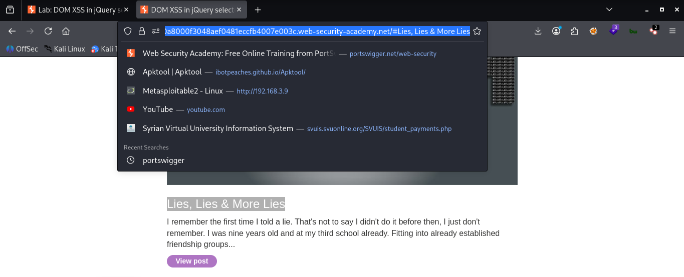
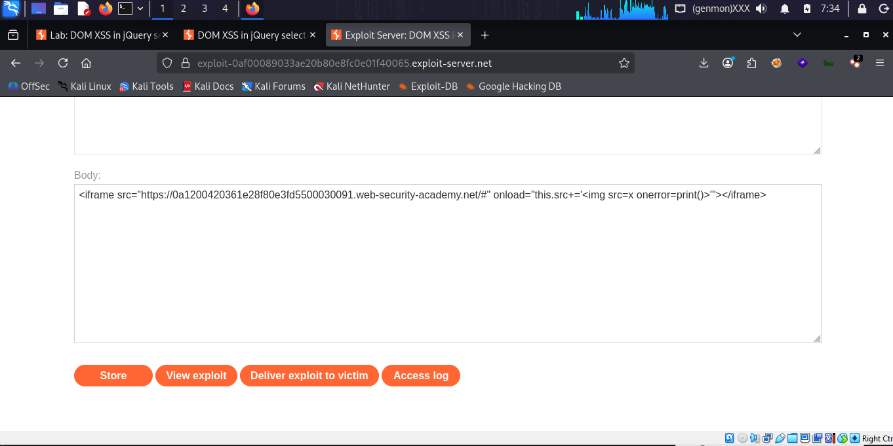
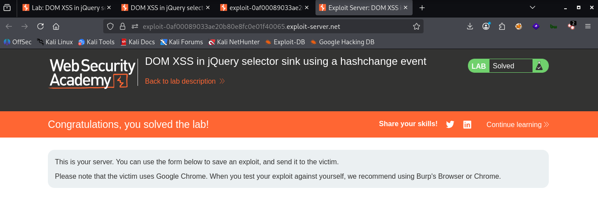

# LAB 06 -  DOM XSS in jQuery selector sink using a hashchange event

## Lab Information

- **Category:** Cross-Site Scripting (XSS)
- **Type:** DOM-based 
- **Difficulty:** Apprentice
- **Status:** ✅ Solved
- **Date:** 2026-8-16

---


---

# Table of Contents

- Executive Summary
- Lab Information
- Objective
- Vulnerability Overview
- Attack Prerequisites
- Environment & Scope
- Methodology
- Discovery Process
- Technical Analysis
- Payload Analysis
- Exploitation Flow
- Evidence
- Impact
- Root Cause
- Risk Assessment
- Remediation
- Lessons Learned
- References
- Screenshots

---

# Executive Summary

A DOM-based Cross-Site Scripting (XSS) vulnerability was identified in this lab. 
Attacker-controlled input is obtained from `window.location.hash` and passed 
directly into a jQuery selector through the `:contains()` expression.

The vulnerable code is triggered by the `hashchange` event whenever the URL 
fragment changes. Because the attacker-controlled value is inserted directly 
into the jQuery selector without appropriate validation, a crafted hash can 
alter the selector and lead to JavaScript execution in the victim's browser.

In this lab, the vulnerability was successfully exploited using an 
`<iframe>` and an injected `` element with an `onerror` event handler 
that calls `print()`.

---

# Objective

The objective of this lab is to exploit a DOM-based XSS vulnerability caused 
by the unsafe flow of attacker-controlled data from `window.location.hash` 
(source) into a jQuery `$()` selector (sink).

The vulnerability is triggered through the `hashchange` event, which causes 
the client-side JavaScript to process the attacker-controlled hash value.

---

# Vulnerability Overview

A DOM-based XSS (Document Object Model-based Cross-Site Scripting) 
vulnerability occurs when client-side JavaScript takes attacker-controlled 
data from a source and passes it unsafely to a dangerous DOM operation or 
JavaScript API.

In this lab, the attacker-controlled source is:

```javascript
window.location.hash
```
The value is processed using:
and:

```javascript
decodeURIComponent(...)
```
The resulting value is then concatenated directly into a jQuery selector:

```javascript
$('section.blog-list h2:contains(' + 
    decodeURIComponent(window.location.hash.slice(1)) + 
')');
```
The vulnerability occurs because attacker-controlled data is incorporated into the selector without appropriate validation.
The hashchange event causes this vulnerable code to execute whenever the URL fragment is changed.

---


# Attack Requirements

- An attacker-controlled source: `window.location.hash`.
- A vulnerable jQuery `$()` selector sink.
- A `hashchange` event that causes the vulnerable code to execute when the hash changes.
- A jQuery version/selector behavior that allows the crafted selector to be interpreted in a dangerous way.
  
---

# Environment & Scope

| Item              | Value |
|-------------------|-------|
| Target            | PortSwigger Web Security Academy lab |
| HTTP Method       | GET |
| Source            | `window.location.hash` |
| Sink              | `jQuery `$()` selector` |
| Injection Context | jQuery Selector Context |
| Client            | Web Browser |

---

# Methodology

1. Open the vulnerable lab.
2. Inspect the client-side JavaScript.
3. Identify `window.location.hash` as the attacker-controlled source.
4. Identify the `hashchange` event that triggers the vulnerable code.
5. Trace the attacker-controlled value into the jQuery `$()` selector.
6. Analyze how the value is processed by `slice(1)` and `decodeURIComponent()`.
7. Test the selector using controlled hash values.
8. Construct an exploit using an `<iframe>` to trigger the `hashchange` event.
9. Inject an `` element with an `onerror` handler calling `print()`.
10. Verify successful JavaScript execution.

---

# Discovery Process

### Step 1 — Testing the URL Fragment

```text
#mohamad
```

The value after the # is available through:

```javascript
window.location.hash
```
For example:

window.location.hash
→ #mohamad

The application then removes the leading # using:

```javascript
window.location.hash.slice(1)
```
resulting in: mohamad


### Step 2 — Testing the jQuery Selector

I tested a value containing a closing parenthesis:

```text
/#mohamad)
```
The additional ) affected the structure of the generated jQuery :contains() selector and resulted in a jQuery syntax error.
This confirmed that the attacker-controlled hash value was being inserted directly into the selector.

### Step 3 — Triggering the Hashchange Event

The exploit uses an `<iframe>` to load the vulnerable page with an empty 
hash and then modifies the iframe URL after it loads.

```html
<iframe src="LAB-URL/#"
        onload="this.src+=''">
</iframe>
```
Changing the iframe URL causes the URL fragment to change, which triggers the hashchange event and executes the vulnerable jQuery selector.
The injected  element uses an invalid image source, causing the onerror event to execute:

```html
print()
```
The appearance of the print dialog confirms successful JavaScript execution.

---

# Technical Analysis

The vulnerable client-side code is:

```javascript
$(window).on('hashchange', function() {
    var post = $('section.blog-list h2:contains(' +
        decodeURIComponent(window.location.hash.slice(1)) +
    ')');

    if (post) post.get(0).scrollIntoView();
});
```
The application reads the URL fragment using window.location.hash.
The slice(1) operation removes the leading #, and decodeURIComponent() decodes the resulting value.
The decoded value is then concatenated directly into a jQuery :contains() selector.

### Vulnerable JavaScript

```javascript
$(window).on('hashchange', function(){
    var post = $('section.blog-list h2:contains(' +
        decodeURIComponent(window.location.hash.slice(1)) +
    ')');

    if (post) post.get(0).scrollIntoView();
});
```
The code registers a `hashchange` event handler. When the URL fragment 
changes, the handler reads `window.location.hash`, removes the leading `#`, 
decodes the value, and inserts it into the jQuery selector.


### After Injection

After modifying the URL fragment, the attacker-controlled value is processed
by the vulnerable JavaScript code.

For example, the exploit uses an iframe to load the vulnerable page and then
changes its URL fragment:

```html
<iframe src="LAB-URL/#"
        onload="this.src+=''">
</iframe>
```
When the iframe loads, its onload handler changes the URL fragment. This causes the hashchange event to fire and the vulnerable JavaScript code to execute again.

The vulnerable code processes the fragment using:

```javascript
window.location.hash.slice(1)
```
and:

```javascript
decodeURIComponent(...)
```
The resulting value is then inserted into the jQuery selector:

```javascript
$('section.blog-list h2:contains(' +
    decodeURIComponent(window.location.hash.slice(1)) +
')');
```
The attacker-controlled value can therefore influence the structure of the jQuery selector.

The injected HTML element is:

```html

```
Because the image source x is invalid, the browser triggers the onerror event, which executes:

```html
print()
```
The appearance of the print dialog confirms successful JavaScript execution.

``` Note:
> The `<iframe>` is part of the exploit delivery mechanism. It is not
> part of the vulnerable JavaScript code itself. Its purpose is to cause the
> URL fragment to change and trigger the `hashchange` event.
```

---

# Source and Sink Analysis

## Source

```javascript
window.location.hash
```
The URL fragment is attacker-controlled.

## Data Processing

```javascript
window.location.hash.slice(1)
```
This removes the leading #
The value is then passed through:

```javascript
decodeURIComponent(...)
```
to decode URL-encoded characters.

## Data Flow

```javascript
decodeURIComponent(window.location.hash.slice(1))
```

The resulting value is concatenated into the jQuery selector.

## Sink

```javascript
$('section.blog-list h2:contains(' +
    decodeURIComponent(window.location.hash.slice(1)) +
')');
```

The jQuery $() function processes the attacker-controlled value as part of a selector.

---

# Context Analysis

| Property | Value |
|---|---|
| Source | `window.location.hash` |
| Sink | `jQuery `$()` selector` |
| Injection Context | jQuery Selector Context  |
| Encoding | None |
| Reflection Type | DOM-based |
| URL Scheme Validation | None |
| Payload Type | `<iframe></iframe>` HTML Attribute |
| Execution Trigger | User activates the manipulated link |

---

# Payload Analysis

## Payload Used

```html
<iframe src="LAB-URL/#"
        onload="this.src+=''">
</iframe>

```

## Why This Payload Works

```html
<iframe>
```
Loads the lab.

```
/#
```
Sets the page to start with a hash.

```html
onload
```
Executes after the iframe loads.

```html
this.src += ...
```
Changes the iframe's source, thereby changing the hash.

```
hashchange
```
Changing the hash triggers:

```html
$(window).on('hashchange', ...)

```
Creates an image with an invalid source.

```html
onerror=print()
```
When the image fails to load, the following executes:

```html
print()
```
This indicates the successful exploitation of the lab.

---

# Exploitation Flow

```text
Exploit Server
   │
   ▼
iframe
   │
   ▼
hashchange
   │
   ▼
location.hash
   │
   ▼
slice(1)
   │
   ▼
decodeURIComponent()
   │
   ▼
jQuery $() sink
   │
   ▼
HTML interpretation
   │
   ▼

   │
   ▼
onerror
   │
   ▼
print()
```

---

# Evidence

## HTML Before Injection

```javascript
$('section.blog-list h2:contains(' + decodeURIComponent(window.location.hash.slice(1)) + ')');
```

## URL Fragment

```text
https://LAB-ID/#mohamad
```
The value after # is available through 'window.location.hash' after 'window.location.hash.slice(1)' the value becomes mohamad

---

## HTML After Injection

 ```html
<iframe src="LAB-URL/#"
        onload="this.src+=''">
</iframe>
 ```

The `<iframe>` element reloaded the page to trigger the `hashchange` event; we then added an `` element with an `onerror` event handler that displays the print page.


## Result

```text
<iframe></iframe>
        ↓

        ↓
Event Execution
        ↓
View print page
```
---

# Impact

### Demonstrated Impact

- JavaScript execution in the victim's browser context.

### Potential Impact

Depending on the application and victim privileges, DOM XSS could
potentially allow:

- Manipulation of page content.
- Phishing and UI manipulation.
- Performing actions in the victim's browser context.
- Access to information available to JavaScript.
- Potential account compromise in vulnerable scenarios.
  
---

# Root Cause

The root cause is the use of attacker-controlled data from
`window.location.hash` directly inside a jQuery selector.

The application constructs the selector by concatenating the decoded
hash value into the `:contains()` expression without safely validating
or restricting the input.

Because the vulnerable jQuery selector processes the attacker-controlled
value in an unsafe manner, a crafted hash can lead to DOM XSS.

---

# Risk Assessment

| Item | Value |
|------|-------|
| Severity |  Context-dependent |
| CVSS Score | Not calculated |
| CWE | CWE-79: Improper Neutralization of Input During Web Page Generation |
| OWASP Category | Cross-Site Scripting (XSS) |
| Exploitability | Demonstrated in lab |
| Business Impact | Theft of customer accounts and sensitive data , Financial fraud and theft of funds , Reputational damage and loss of trust , Legal Fines and Penalties , Business disruption and incident response costs|

---

# Remediation

- Avoid constructing jQuery selectors by concatenating untrusted input.
- Validate and constrain values obtained from `window.location.hash`.
- Use safe DOM APIs instead of dynamically constructing selectors from user-controlled data.
- Upgrade outdated versions of jQuery to a currently supported version.
- Apply appropriate input validation and sanitization where necessary.
- Implement a restrictive Content Security Policy (CSP) as an additional defense layer.
  
---

# Lessons Learned

- DOM XSS can occur entirely on the client side.
- `window.location.hash` can be an attacker-controlled source.
- `hashchange` can cause vulnerable client-side code to execute when the URL fragment changes.
- jQuery selectors can become dangerous sinks when attacker-controlled data is concatenated into them.
- `slice(1)` removes the `#` character from the hash before processing the value.
- `decodeURIComponent()` decodes URL-encoded input before it reaches the selector.
- Source → Data Flow → Sink analysis is essential when investigating DOM-based XSS.
- Keeping client-side libraries such as jQuery updated is an important security measure.
  
---

# References

- OWASP
- PortSwigger Web Security Academy
- MITRE CWE
- CVSS Specification

---

# Screenshots

## Initial Page



...

## Payload Injection




...

.png)


...

## Successful Alert



---

# Execution Condition

The exploit relies on the `hashchange` event.

When the victim loads the exploit page, the iframe initially loads the
target page with a `#` fragment. The iframe's `onload` handler then
changes its `src`, which changes the URL fragment.

This triggers the vulnerable `hashchange` handler and causes the
attacker-controlled value to reach the jQuery selector.

---

# Conclusion

This practical experiment demonstrated how a DOM-based XSS vulnerability
can arise when attacker-controlled data from `window.location.hash` is
passed into a vulnerable jQuery selector.

The key lesson is that DOM XSS is not limited to obvious sinks such as
`innerHTML` or event-handler attributes. Client-side libraries and
selector APIs can also become dangerous when attacker-controlled data is
inserted into them without appropriate validation.

The exploitation chain was:

```text
window.location.hash
        ↓
 hashchange event
        ↓
     slice(1)
        ↓
decodeURIComponent()
        ↓
 jQuery selector
        ↓
   crafted HTML
        ↓
     onerror
        ↓
      print()
```
