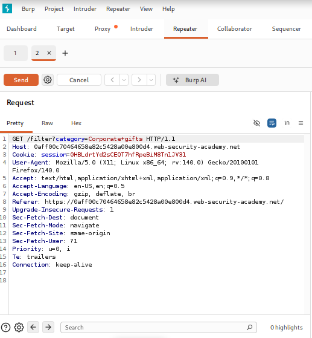
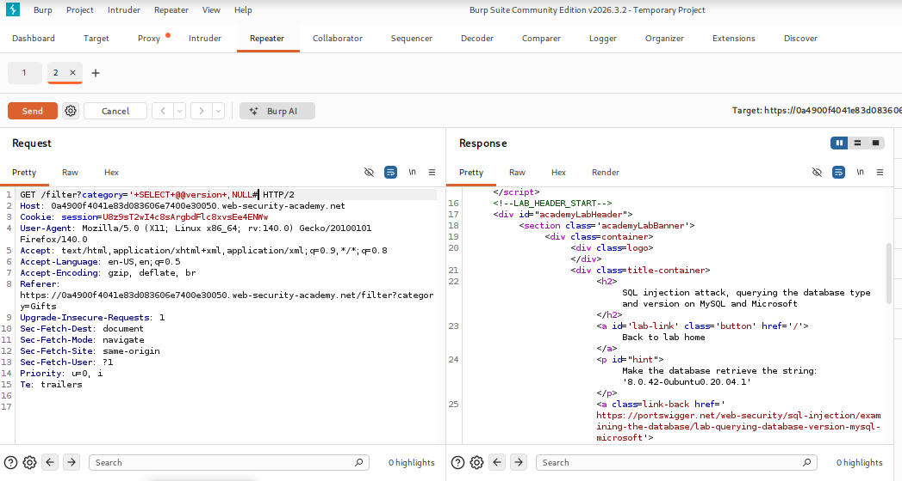
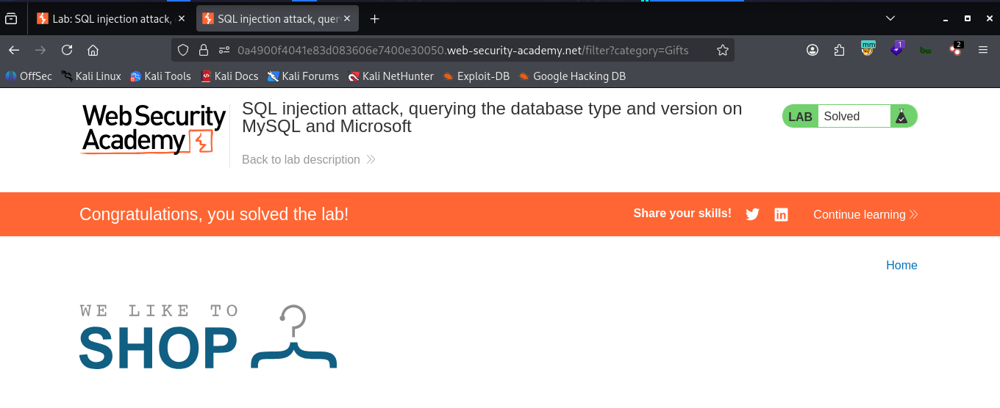

# LAB 04 - Querying Database Type and Version (MySQL & Microsoft SQL Server)

## Lab Information

- **Category:** SQL Injection
- **Difficulty:** Practitioner
- **Status:** ✅ Solved
- **Date:** 2026-7-22

---


---

## Objective

The objective of this lab is to exploit a UNION-based SQL Injection vulnerability to identify whether the back-end database is MySQL or Microsoft SQL Server and retrieve its version information.
---

## Vulnerability Overview

In this lab, a UNION-based SQL Injection vulnerability was exploited to retrieve the database version. The application could be using either MySQL or Microsoft SQL Server, both of which support the @@version variable. By combining the original query with a malicious UNION SELECT statement, version information was successfully retrieved.

---

## Methodology

1. Browse to the vulnerable category page.
2. Intercept the HTTP request using Burp Suite.
3. Identify the vulnerable category parameter.
4. Inject a UNION SELECT payload.
5. Retrieve the database version using the @@version variable.
---

## Payload Used

```sql
' UNION SELECT @@version,NULL#
```
(#) is used as the comment character in MySQL.

---

## Why It Worked

The payload terminated the original SQL query and appended a UNION SELECT statement. Because both queries returned the same number of columns with compatible data types, My SQL combined the results and returned the database version from the @@version table.
The @@version system variable stores the version information for both MySQL and Microsoft SQL Server.

---

## Impact

An attacker can access information about the database version, enabling them to identify vulnerabilities associated with the specific database type and version.

---

## Root Cause

The application directly concatenated user-controlled input into the SQL query without using parameterized statements, allowing attackers to inject arbitrary SQL commands.

---

## Remediation

- **Prepared Statements**
  - Prevent SQL queries from being modified by user input.

- **Input Validation**
  - Reject unexpected input.

- **Least Privilege**
  - Reduce the impact if SQL Injection occurs.

---

## Lessons Learned

- UNION-based SQL Injection requires the same number of columns.
- Data types of the selected columns must be compatible.
- My SQL stores version information in the @@version table.
- Database fingerprinting is often the first step before further exploitation.
- Different database systems expose version information using different system variables or tables.

---

## SQL Query Analysis

The application likely executed the following SQL query:

```sql
SELECT name,description
FROM products
WHERE category='Gifts';

```

After SQL injection:

```sql
SELECT name,description
FROM products
WHERE category=''
UNION
SELECT @@version,NULL#


```

---

## Database Specific Notes

- Database: MySQL / Microsoft SQL Server
- Version Variable: @@version
- Comment Syntax Used: #
  
---

## Key Takeaways

- UNION SELECT requires matching columns.
- @@version works on MySQL and Microsoft SQL Server.
- Database fingerprinting helps identify DBMS-specific attack techniques.

---

## Screenshots

### Before Exploitation



### Burp Request



### Result


