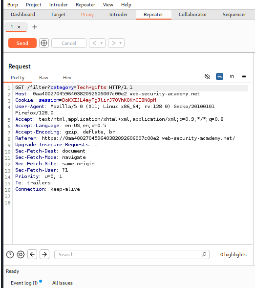
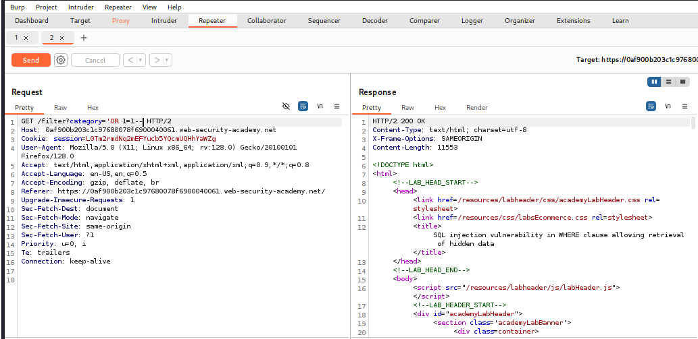
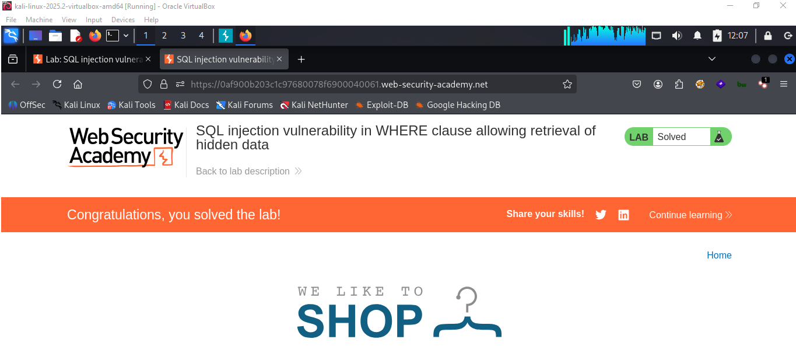

# LAB 01 - Retrieving Hidden Data

## Lab Information

- **Category:** SQL Injection
- **Difficulty:** Apprentice
- **Status:** ✅ Solved
- **Date:** 2026-6-29

---


---

## Objective

The objective of this lab is to exploit a SQL Injection vulnerability to retrieve hidden products by modifying the SQL WHERE clause.

---

## Vulnerability Overview

SQL Injection occurs when user-controlled input is embedded directly into an SQL query without proper parameterization. In this lab, the application failed to sanitize the category parameter, allowing an attacker to inject SQL code that altered the WHERE clause. As a result, the query returned hidden products that should not have been accessible.
---

## Methodology

1. Browse the product category.
2. Intercept the request using Burp Suite.
3. Identify the category parameter.
4. Inject a simple SQL payload.
5. Observe that hidden products are displayed.

---

## Payload Used

```sql
' OR 1=1--
```

---

## Why It Worked

This payload (SQL injection) succeeds when the application incorporates user input directly into the backend query without sanitization or validation, tricking the database into executing a condition that is always true.
---

## Impact

An attacker can retrieve hidden data that should not be accessible to normal users.
---

## Root Cause

The application directly concatenates user input into the SQL query without using parameterized queries.
---

## Remediation

- **Prepared Statements**
  - Prevent SQL queries from being modified by user input.

- **Input Validation**
  - Reject unexpected input.

- **Least Privilege**
  - Reduce the impact if SQL Injection occurs.

---

## Lessons Learned
I learned that SQL Injection is based on understanding SQL queries rather than memorizing payloads.

User input should never be trusted.

Small changes in the WHERE clause can completely change the query result.

---

## Screenshots

### Before Exploitation



### Burp Request



### Result




