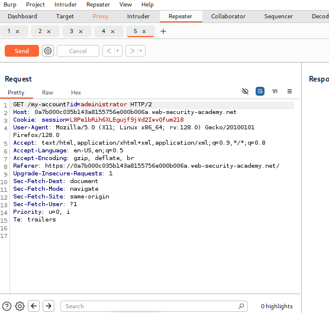
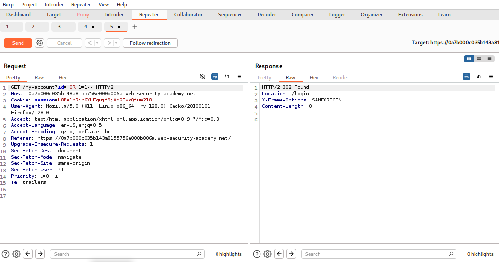
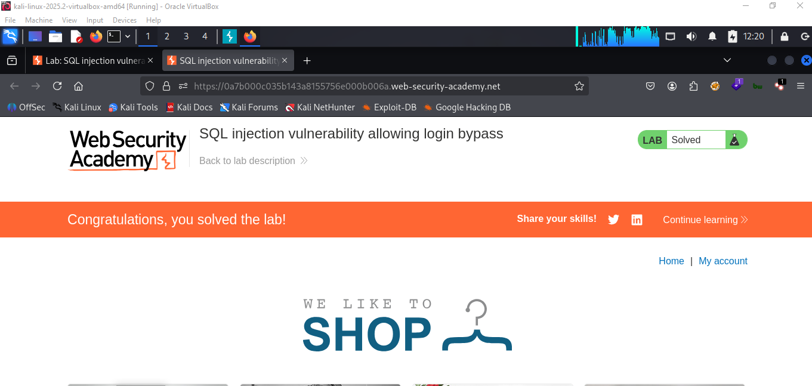

# LAB 02 - Login Bypass

## Lab Information

- **Category:** SQL Injection
- **Difficulty:** Apprentice
- **Status:** ✅ Solved
- **Date:** 2026-7-7

---


---

## Objective

The objective of this lab is to exploit a SQL Injection vulnerability to find information about the Oracle database version.

---

## Vulnerability Overview

SQL Injection occurs when user-controlled input is embedded directly into an SQL query without proper parameterization.
In this lab , we combine two queries using UNION to retrieve information about the database version, provided that the number of columns in both queries is equal..

---

## Methodology

1. Browse to the login page.
2. Intercept the login request using Burp Suite.
3. Identify the username and password parameters.
4. Inject a SQL payload into the username field.
5. Submit the request.
6. Successfully authenticate as the administrator.

---

## Payload Used

```sql
' OR 1=1--
```

---

## Why It Worked

The payload terminated the original SQL string and commented out the password check. As a result, the database authenticated the request as the administrator without verifying the password.

---

## Impact

An attacker can authenticate as another user without knowing valid credentials, potentially gaining unauthorized access to sensitive functionality.

---

## Root Cause

The application directly concatenated the username input into the authentication query without using parameterized statements.

---

## Remediation

- **Prepared Statements**
  - Prevent SQL queries from being modified by user input.

- **Input Validation**
  - Reject unexpected input.

- **Least Privilege**
  - Reduce the impact if SQL Injection occurs.

---

## Lessons Learned

- Login forms can also be vulnerable to SQL Injection.
- SQL Injection is not limited to retrieving data.
- Authentication logic should never trust user input.
- Parameterized queries are essential for secure authentication.

---

## Authentication Query

The application likely executed the following SQL query:

```sql
SELECT *
FROM users
WHERE username='administrator'
AND password='password';
```

After SQL injection:

```sql
SELECT *
FROM users
WHERE username='administrator'--'
AND password='password';
```

The comment sequence (`--`) caused the password check to be ignored, allowing authentication without a valid password.

---

## Screenshots

### Before Exploitation



### Burp Request



### Result


