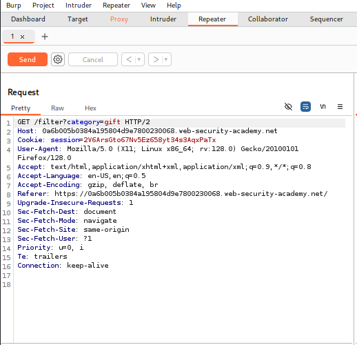
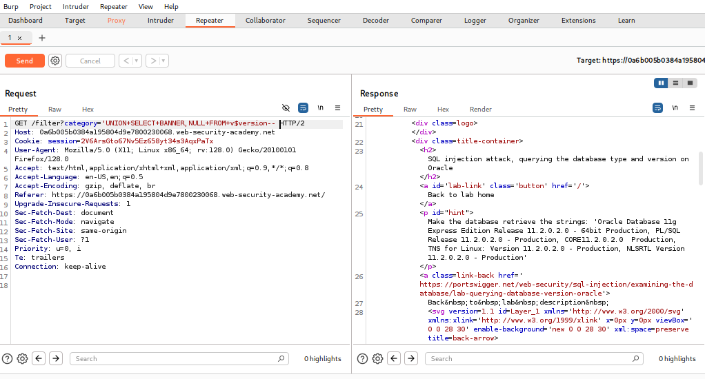
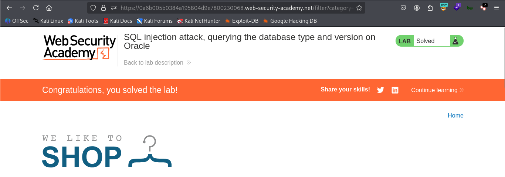

# LAB 03 - Querying The Database Type And Version On Oracle

## Lab Information

- **Category:** SQL Injection
- **Difficulty:** Practitioner
- **Status:** ✅ Solved
- **Date:** 2026-7-7

---


---

## Objective

The objective of this lab is to exploit a SQL Injection vulnerability to find information about the Oracle database version.

---

## Vulnerability Overview

SQL Injection occurs when user-controlled input is embedded directly into an SQL query without proper parameterization.
In this lab , we combine two queries using UNION to retrieve information about the database version, provided that the number of columns in both queries is equal..

---

## Methodology

1. Browse to the category page.
2. Intercepting the product page using Burp Suite.
3. Inject a SQL payload into the category field.
4. Submit the request.
5. Retrieving information and generating the database within the request.

---

## Payload Used

```sql
'UNION+SELECT+BANNER,NULL+FROM+v$version--
```

---

## Why It Worked

The payload terminated merge two queries the first concerning the item and the second concerning database version information provided that the number of columns in both queries is equal.

---

## Impact

An attacker can access information about the database version, enabling them to identify vulnerabilities associated with the specific database type and version.

---

## Root Cause

Failure of the application to sanitize and separate user inputs from underlying database commands.

---

## Remediation

- **Prepared Statements**
  - Prevent SQL queries from being modified by user input.

- **Input Validation**
  - Reject unexpected input.

- **Least Privilege**
  - Reduce the impact if SQL Injection occurs.

---

## Lessons Learned

- Separating data from commands: Mandatory reliance on prepared statements to prevent user input from being executed as code.
- Restricting account privileges: Blocking the application account's access to sensitive system tables and applying the principle of least privilege.
- Error message masking: Preventing database error details from being displayed to the end-user and replacing them with standardized, generic messages.
- Automating Security Scanning: Integrating automated scanning tools (SAST/DAST) into the development environment to detect injection vulnerabilities before code deployment.
- Implementing layered defense: Using a Web Application Firewall (WAF) to immediately detect and block injection attempts and suspicious patterns.

---

## Authentication Query

The application likely executed the following SQL query:

```sql
SELECT *
FROM product
WHERE category='gift'

```

After SQL injection:

```sql
SELECT * FROM product WHERE category='gift' UNION SELECT BANNER FROM version

```

---

## Screenshots

### Before Exploitation



### Burp Request



### Result


